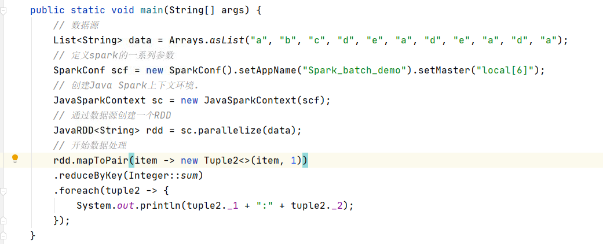
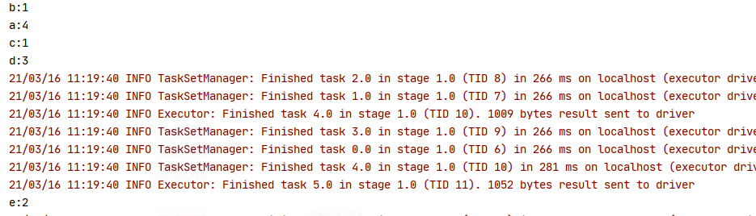
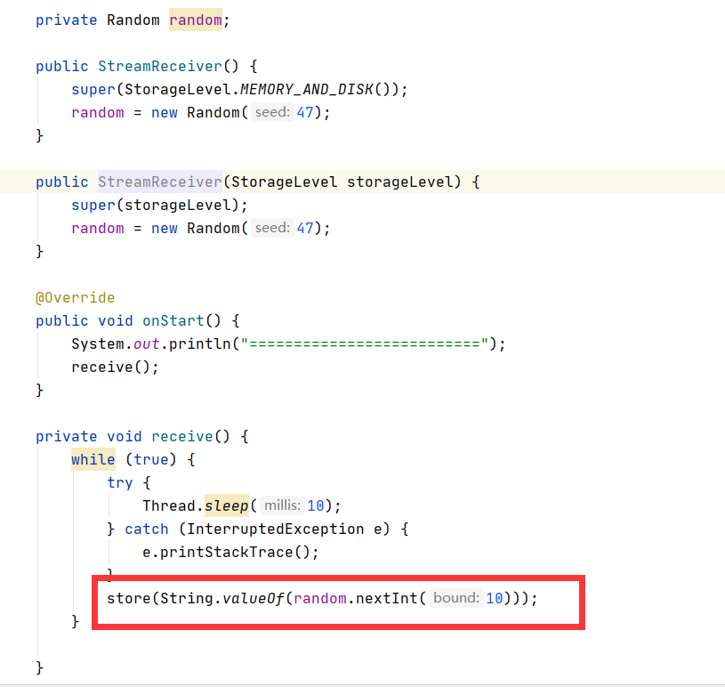
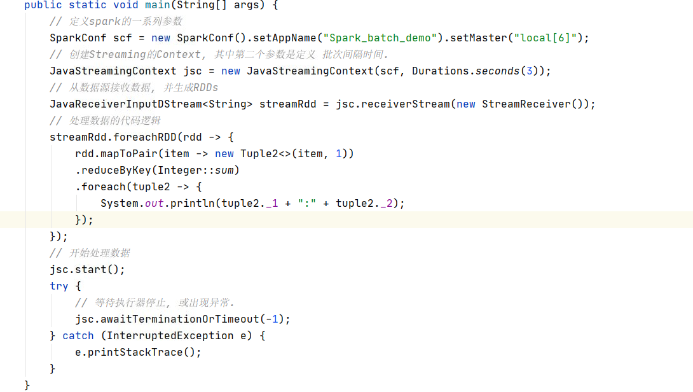
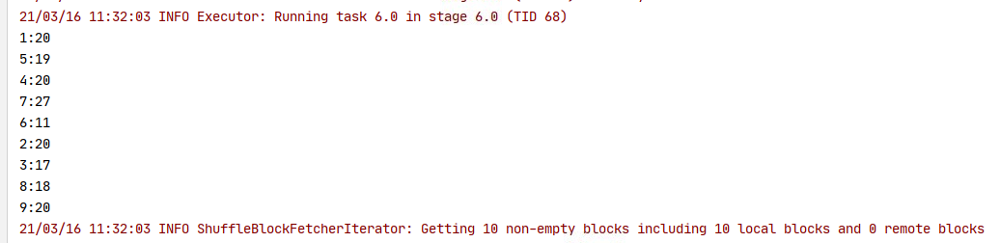
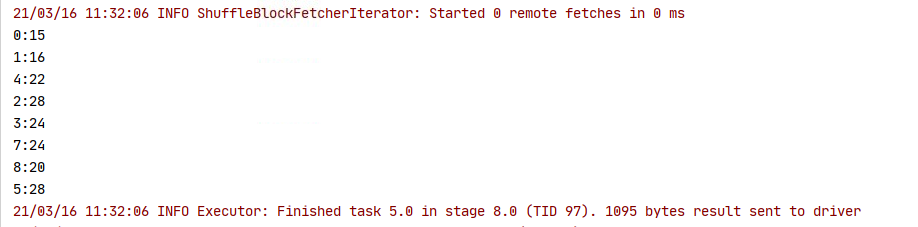

# Spark

Spark是基于内存计算的大数据并行计算框架.

关键字有两个, 内存, 并行.

而 Spark的核心一是 RDD, 二是 DAG.

## 内存

对于大数据的数据处理过程, 往往是需要对原始数据经过一系列的转换,过滤,分组,组合,计算等等步骤来完成, 中间还可能夹杂和外部进行数据交互.

Spark 与 Hadoop的 MapReduce的不同之一则是在于 Spark将整个数据处理都放在内存中去进行执行了除了在shuffle过程中, 在shuffle的过程中, 仍然需要磁盘IO. 

如果不涉及到与其他节点进行交换的话, Spark则可以在内存中一次完成这些操作.

## RDD

RDD（Resilient Distributed Dataset）叫做弹性分布式数据集，是Spark中最基本的数据抽象，它代表一个不可变、可分区、里面的元素可并行计算的集合。

### RDD 域

1. 一组分片（Partitions），即数据集的基本组成单位。对于RDD来说，每个分片都会被一个计算任务处理，并决定并行计算的粒度。用户可以在创建RDD时指定RDD的分片个数，如果没有指定，那么就会采用默认值。默认值就是程序所分配到的CPU Core的数目。

2. 一个计算每个分区的函数(Compute)。Spark中RDD的计算是以分片为单位的，每个RDD都会实现compute函数以达到这个目的。compute函数会对迭代器进行复合，不需要保存每次计算的结果。

3. RDD之间的依赖关系。RDD的每次转换都会生成一个新的RDD，所以RDD之间就会形成类似于流水线一样的前后依赖关系。**在部分分区数据丢失时，Spark可以通过这个依赖关系重新计算丢失的分区数据，而不是对RDD的所有分区进行重新计算。**

> 参考链接: [spark中RDD 的依赖关系](https://blog.csdn.net/weixin_43909382/article/details/90384193)

4. 一个Partitioner，即RDD的分片函数。当前Spark中实现了两种类型的分片函数，一个是基于哈希的HashPartitioner，另外一个是基于范围的RangePartitioner。只有对于于key-value的RDD，才会有Partitioner，非key-value的RDD的Parititioner的值是None。Partitioner函数不但决定了RDD本身的分片数量，也决定了parent RDD Shuffle输出时的分片数量。

> 参考链接:
> 
>  [Spark RDD之Partitioner](https://blog.csdn.net/qq_34842671/article/details/83685179)
> 
> [RangePartitioner](https://blog.csdn.net/u011564172/article/details/54380574)
> 
> [Spark Shuffle概念及shuffle机制](https://zhuanlan.zhihu.com/p/70331869)

5. 一个列表，存储存取每个Partition的优先位置（preferred location）。对于一个HDFS文件来说，这个列表保存的就是每个Partition所在的块的位置。按照“移动数据不如移动计算”的理念，Spark在进行任务调度的时候，会尽可能地将计算任务分配到其所要处理数据块的存储位置。

> [Spark的位置优先: TaskSetManager 的有效 Locality Levels](https://blog.csdn.net/u011007180/article/details/53523645)

## 并行

RDD内部的数据区分了不同的Partition, 不同的Partition可能存储在不同的节点上，且会根据指定的并行度进行并行计算。

# Spark 三种组件

这里指的是Spark的离线处理, 也是整个 Spark的核心处理流程, 因为 Spark的其他组件正是依赖于此的.

就 Spark批处理, Spark Streaming, StructuredStreaming 而言.

其区别与关系如下:

Spark批处理, 即是通过 Spark RDD 作为底层数据结构, 完成对数据的一系列操作.

SparkStreaming 是按照时间, 批量的从数据源去加载数据, 同样是以 RDD 作为底层的数据结构, 完成对数据的一系列操作.

Spark SQL 则有所不同, 是以 DataFrame 作为底层的数据结构, 比较类似于在内存中 数据库, 数据表 这种方式, 进而通过类SQL的方式, 完成对数据的各种操作.

> DataFrame多了数据的结构信息，即schema。RDD是分布式的 Java对象的集合。DataFrame是分布式的Row对象的集合。DataFrame除了提供了比RDD更丰富的算子以外，更重要的特点是提升执行效率、减少数据读取以及执行计划的优化
> 
> Datasets, Dataset是数据的分布式集合。Dataset是在Spark 1.6中添加的一个新接口，是DataFrame之上更高一级的抽象。它提供了RDD的优点（强类型化，使用强大的lambda函数的能力）以及Spark SQL优化后的执行引擎的优点。一个Dataset 可以从JVM对象构造，然后使用函数转换（map， flatMap，filter等）去操作。

StructuredStreaming 则是 SparkStreaming 与 Spark SQL的结合体. 底层以 DataFrame为数据结构, 在不断加载数据的过程中, 去填充, 更新 '数据库', '数据表'的方式 完成对数据的各种操作.

# 三种组件的示例

## Spark 批处理

        SparkConf conf = new SparkConf().setAppName(appName).setMaster(master);
        JavaSparkContext sc = new JavaSparkContext(conf);

创建RDD的方式有以下几种:

* 从数据集合中创建

        List<Integer> data = Arrays.asList(1, 2, 3, 4, 5);
        JavaRDD<Integer> distData = sc.parallelize(data);

* 从文件中读取

        JavaRDD<String> distFile = sc.textFile("data.txt");

  读取的时候支持从文件中读取, 文件夹读取多个文件, 通配符, 甚至于是读取压缩文件.

也可以通过 RDD 来创建新的 RDD.

示例程序:

前三行代码 分别是数据源, SparkConfig (可以将各种Spark配置定义在这个地方, 优先级最高.), SparkContext.

这些是必须的.

在数据转换处理方面, 与 Java的Stream有点相似.

都是 transform 和 action两种.

transform 主要是用来做数据转换, 比如 map, flatMap, mapToPair 等等.

而只有当遇到action的时候 才会真正开始执行计算过程. 而action则包括了 save, count, reduce, forEach等等.

示例代码主要功能是, 对字符串做统计, 统计每个字符串出现的次数.

具体流程是: 转换为数据对 key是字符串, value是1. 而后reduceByKey, 对于key相同的不断累加处理, 进行统计. 最终forEach输出统计结果.

执行结果如图:

## SparkStreaming 示例

在这里, 我采取了自定义的数据源的方式

比较简单, 每10ms, 生成一个10以内的数字.

处理程序如下

就像在前面介绍的一样, SparkStreaming 是按照时间, 批量的从数据源去加载数据.

在这里定义的批处理间隔时间是: Duration.seconds(3)

处理代码的逻辑不变.

如果你在这里需要对多个批次之间的数据做关联处理, 交互, 比如统计十分钟内的出现频次, 可以使用窗口函数.

如果同时需要不断与Mysql做更新, 重新计算, 就需要在每个批次内, 去链接数据库, 进行处理.

处理结果大致如图:

分别是在03秒, 以及 06秒进行的统计.

在这里, 需要关注的地方有几个:

一是, 由于任务可能被下发到多个机器, 因此数据库的链接初始化 一定不能在 forEach之外完成. 一般所需要的方式是:

错误操作:

        dstream.foreachRDD(rdd -> {
        Connection connection = createNewConnection(); // 在driver节点执行
        rdd.foreach(record -> {
                connection.send(record); // 在 worker节点执行.
        });
        });
而Connection往往又无法被序列化, 因此在 worker节点上依然拿不到连接.

        dstream.foreachRDD(rdd -> {
        rdd.foreach(record -> {
                Connection connection = createNewConnection();
                connection.send(record);
                connection.close();
        });
        });
因此往往需要采用如下这种方式:

        dstream.foreachRDD(rdd -> {
        rdd.foreachPartition(partitionOfRecords -> {
                // ConnectionPool is a static, lazily initialized pool of connections
                Connection connection = ConnectionPool.getConnection();
                while (partitionOfRecords.hasNext()) {
                connection.send(partitionOfRecords.next());
                }
                ConnectionPool.returnConnection(connection); // return to the pool for future reuse
        });
        });
如果仅仅是想单纯的处理数据, 但并不在这一就需要进行foreachRDD 用以完成流的执行计算呢?

伪代码如下:

        dstreamTemp = dstream.foreachRDD(rdd -> {
        rdd.foreachPartition(partitionOfRecords -> {
                Connection connection = ConnectionPool.getConnection();
                while (partitionOfRecords.hasNext()) {
                //进行查询数据, 填充 补全, 过滤 当前stream中的数据, 用以下一步继续处理.
                }
                ConnectionPool.returnConnection(connection); // return to the pool for future reuse
        });
        });

        dstreamTemp.nextAction;
但foreachRDD 是不会返回流的, 因此可以采用

        dstreamTemp = dstream.mapPairtition();
        dstreamTemp = dstream.mapToPairPartition();

## StructuredStreaming示例

在本次Demo中, 使用了 Socket接收数据, 作为流的输入源.

        // 从socket去接收数据
        Dataset<Row> lines = spark
                .readStream()
                .format("socket")
                .option("host", "localhost")
                .option("port", 9999)
                .load();

        // 将数据切分成单个单词
        // 在这一步, 就是将数据转换成 DataFrame作为底层的格式了.
        Dataset<String> words = lines
                .as(Encoders.STRING())
                .flatMap((FlatMapFunction<String, String>) x -> Arrays.asList(x.split(" ")).iterator(), Encoders.STRING());

        // 这一步比较像是 mysql中的 select count(*) from xxx group by value.
        Dataset<Row> wordCounts = words.groupBy("value").count();

        // 指定了需要将数据输出到 控制台.
        StreamingQuery query = wordCounts.writeStream()
                .outputMode("complete")
                .format("console")
                .start();

        query.awaitTermination();