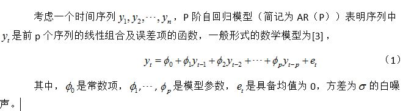

# ARIMA模型

> [ARIMA模型详解](http://danzhuibing.github.io/ml_arima_basic.html)

## 名词解释

在名词解释部分, 仅取出需要了解的概念性知识加以描述.

### 协方差

在概率论和统计学中，协方差用于衡量两个变量的总体误差。而方差是协方差的一种特殊情况，即当两个变量是相同的情况。

期望值分别为E[X]与E[Y]的两个实随机变量X与Y之间的协方差Cov(X,Y)定义为：

从直观上来看，协方差表示的是两个变量总体误差的期望。

公式计算的结果意义如下:

* 如果X与Y是统计独立的，那么二者之间的协方差就是0，因为两个独立的随机变量满足E[XY]=E[X]E[Y]。

* 但是，反过来并不成立。即如果X与Y的协方差为0，二者并不一定是统计独立的。

* 若两个随机变量X和Y相互独立，则E[(X-E(X))(Y-E(Y))]=0，因而若上述数学期望不为零，则X和Y必不是相互独立的，亦即它们之间存在着一定的关系。

### 自协方差函数

协方差 能够用来 衡量两个 随机变量之间的 相关性.

自协方差（Autocovariance,简称AF）是时间序列与其滞后项的协方差.

简单来说, 概念如下:

有X的时间序列值: X1, X2 ... X100

则1阶自协方差, 表示 将 X(n) 和  X(n-1) 分别当做两个随机变量, 用以求取协方差.

自然 K阶 自协方差, 表示 将 X(n) 和 X(n-k) 分别当做两个随机变量, 求取协方差.

当K为0时, 求取的就是方差.

公式表示为 Cov(Xt, Xt-k).

也就能够理解, 它能够在一定程度上 反映 自身序列值 之间的相关性.

自然, 在开始提到的滞后项, 指的就是当前项 在 k 个单位时间之后的数值.

>> 而当K的取值逐渐增多, 则能够表示, K个单位时间之后的数据对当前数据的取值影响. 这是不是就是 周期性 数据的 相关性判断呢? 对K以最合理的取值.

>> 是否能够通过这种方式, 求取出对于当前值的 最合理的 K值, 也即相关性最强的数据?对于一组周期性数据, 是否也是能够通过这种方式来判断出来 周期 究竟应该是多少?

### 自相关函数

然而 自协方差跟变量的单位有很大关系，比如X放大10倍，则自协方差将放大100倍，因此其值大小并不能反映相关性的大小。

为了消除量纲（单位）的影响，使用自相关系数来刻画变量与其滞后项的相关性。

自相关系数（Autocorrelation Coefficient，简称ACF）本质是相关系数，等于自协方差除以方差.

自协方差和自相关系数则是刻画同一个变量在不同时期取值的相关程度

### 偏自相关函数

假设对于上证综指价格序列，一阶自相关系数大于0，说明今天的价格与昨天的价格相关，而昨天价格又与前一日价格相关，依次类推，可见当你计算今天与昨天价格之间的自相关系数时，同时包含了更早之前所有各期的信息对今天的间接影响，度量的是过去所有信息加总的影响效果。为了剔除其他各期的影响，单纯考察过去某一单期对今天的影响，引入偏自相关函数（Partial Autocorrelation Coefficient，简称PACF），即条件自相关系数.

而 偏自相关函数 的定义大致上来说是这样的, 对于平稳 AR(p) 序列, 所谓滞后k偏自相关系数就是指在给定了中间 k - 1个随机变量Xt-1, Xt-2... Xt-k+1 的条件下, 或者说, 在剔除了中间 k-1个随机变量的干扰之后, Xt-k 对 Xt影响的相关程度.

公式与求解我就不列出来了. 目前不属于要掌握的部分.

偏自相关函数可以通过自回归模型来表述和求解.

> 参考: [偏自相关性](https://zhuanlan.zhihu.com/p/26525852)

### 平稳性(强平稳 弱平稳)

时间序列分析的主要目的是利用事物特征变量的历史和现状来推测未来可能出现的状况，即假设时间序列的基本特性必须能从过去维持到我们推测的时期，否则，基于历史和现状来预测未来将变得不可靠。

时间序列的平稳性，简单理解是时间序列的基本特性维持不变，换句话说，所谓平稳性就是要求由样本时间序列所得到的曲线在未来的一段时期内仍能沿着现有的形态持续下去。

金融领域很多变量之所以难以估计，是因为这些变量经常发生突变，不是平稳的时间序列。

时间序列的平稳性是经典时间序列分析的基本假设前提，只有基于平稳的时间序列进行的预测才是有效的。

平稳性有强平稳和若平稳之分，一般所说的平稳时间序列指的是弱平稳时间序列。

弱平稳性:

弱平稳放宽了平稳性条件，只要求低阶矩平稳，即数学期望（均值）和方差不随时间和位置变化。弱平稳过程的条件是：

1. 均值函数在所有时间上恒为常数；

2. 存在二阶矩；

3. 对于所有时间t和和时滞k，自协方差相同。

> 值得注意的是，强平稳和弱平稳时间序列二者并没有包含关系。
> 
> 换句话说，强平稳时间序列不一定是弱平稳的，因为强平稳过程不一定存在二阶距；弱平稳时间序列也不一定是强平稳过程，因为弱平稳只能保证一阶矩和二阶距不随时间变化，但不能保证其有穷维分布不随时间变化。
> 
> 弱平稳的正态分布时间序列必定是强平稳的。因为正态分布的概率密度是由均值函数和自相关函数完全确定的，即如果均值函数和自相关函数不随时间变化，则概率密度函数也不随时间变化。

### 自相关性

相关性一般是指两个变量之间的统计关联性.

那么自相关性则是指一个时间序列的两个不同时间点的变量是否相关联。

时间序列具有自相关性是我们能够进行分析的前提，若时间序列的自相关性为0，也就是说各个时点的变量不相互关联，那么未来与现在和过去就没有联系，根据过去信息来推测未来就变得毫无根据。

时间序列的自相关性一般用时间序列的自协方差函数、自相关系数函数和偏自相关系数函数等统计量来衡量。

> 参考: [【Python量化基础】时间序列的自相关性与平稳性](https://zhuanlan.zhihu.com/p/77786430)

## 小结

通过以上概念, 了解了这样几点:

对于时间序列数据, 可以通过 自相关函数, 自协方差函数 两者来确定, 数据自身的变化规律是否满足 自相关的特征. 

偏自相关函数 则是可以表征, 在某个时间周期前的数据, 在剔除曾经数据的影响下, 是否具有 自相关特征.

而我们所需要研究的数据, 其特点是, 在一个时间周期内 是毫无规律可言的, 而在多个时间周期内, 满足 周期性的 特征.

那么研究的目标, 其实对我们而言, 更适合采用 自相关函数 来确定其相关性.

## 模型

### AR

AR是autoregressive的缩写, 也叫自回归模型.

它是用自身做回归变量的过程，即利用前期若干时刻的随机变量的线性组合来描述以后某时刻随机变量的线性回归模型.

AR模型对偏自相关函数（PACF）截尾，对自相关函数(ACF)拖尾。所谓截尾指的是从某阶开始均为（接近）0的性质，拖尾指的是并不存在某一阶突然跳变到0而是逐渐衰减为0。

> 参考: [自回归模型](http://geodesy.blog.sohu.com/273714573.html)

>> 而截尾表达的含义就是, 随着阶数的逐渐增高, 数值变为0, 因此导致 相关性近乎于0, 无法再用来做预测, 即使预测, 结果也不准确.
>>
>> 拖尾的含义代表, 随着阶数逐渐增高, 数值逐渐趋于0, 也即, 阶数越高, 所做出来的结果越不准确.

### MA

移动平均模型/滑动平均模型

MA模型和AR大同小异，它并非是历史时序值的线性组合而是历史白噪声的线性组合。与AR最大的不同之处在于，AR模型中历史白噪声的影响是间接影响当前预测值的（通过影响历史时序值）。

其含义是:

当前时间点的值等于过去若干个时间点的预测误差的回归;

预测误差=模型预测值-真实值; 如果序列依赖过去最近的q个历史预测误差值，称阶数为q，记为MA(q)模型.

MA模型对偏自相关函数（PACF）拖尾，对自相关函数(ACF)截尾.

### ARMA模型

自回归滑动平均模型

AR模型有偏自相关函数截尾性质； MA模型有相关函数截尾性质。 有些因果线性时间序列有与AR和MA类似的表现， 但是不能在低阶实现偏自相关函数截尾或者相关函数截尾。

然而 当 自相关系数和偏自相关系数都没有收敛于0，说明这个时间序列不能纯用低阶的AR模型或者纯用低阶的MA模型来解释, 需要低阶的AR和低阶的MA模型混合来解释。

ARMA模型结合了AR和MA模型，即将 将AR和MA模型混合可得到ARMA模型，AR(p)和MA(q)共同组成了ARMA(p,q), 在对数据拟合优度相近的情况下往往可以得到更简单的模型， 而且不要求偏自相关函数截尾也不要求相关函数截尾.

那么在建模过程中应该如何选择ARMA模型的最佳参数p和q呢? 最常用的技术是采用循环在p和q各自0到5（或者更大）的范围内搜索最小AIC或BIC的(p,q)组合.

### ARIMA模型

> [ARIMA模型详解](http://danzhuibing.github.io/ml_arima_basic.html)

ARMA要求数据具有平稳性, 因此才有了 ARIMA模型.

I(d)：I是integrated的缩写，含义是模型对时间序列进行了差分；因为时间序列分析要求平稳性，不平稳的序列需要通过一定手段转化为平稳序列，一般采用的手段是差分；d表示差分的阶数，t时刻的值减去t-1时刻的值，得到新的时间序列称为1阶差分序列；1阶差分序列的1阶差分序列称为2阶差分序列，以此类推；另外，还有一种特殊的差分是季节性差分S，即一些时间序列反应出一定的周期T，让t时刻的值减去t-T时刻的值得到季节性差分序列。

