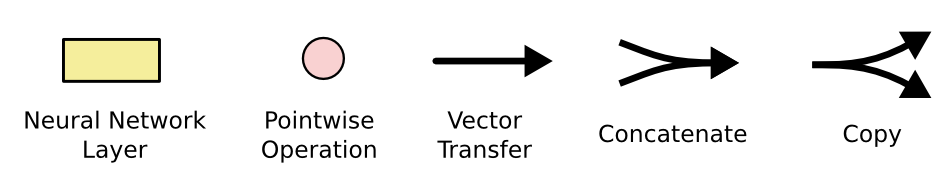
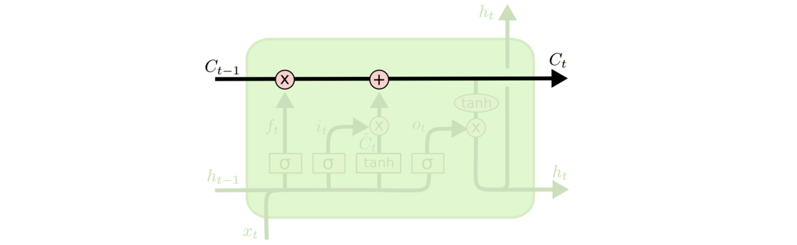
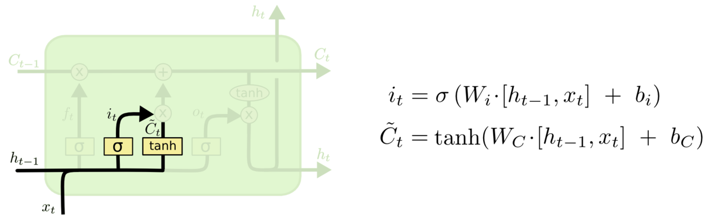
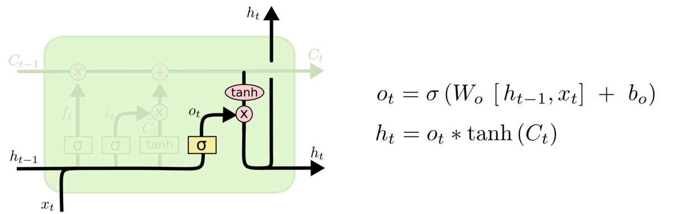

# LSTM

> 原文链接:[[译] 理解 LSTM(Long Short-Term Memory, LSTM) 网络](https://www.cnblogs.com/wangduo/p/6773601.html)

可以确定的说， 凡是能够通过 hot-winters实现的， 一定能够通过神经网络来实现， 因为无非是将不同的季节作为特定的特征值来进行处理。

而LSTM的基础是RNN， RNN的弊端比较明显， RNN虽然已经支持了对往期数据的记忆， 但有两个问题， 最大的问题是 长期记忆的问题。 目前RNN只能够做到短期记忆， 具体原因我暂时还不太清楚， 短期大概就是 7~10个长度左右的记忆时间。 另一个问题就是梯度消失的问题。

LSTM 通过刻意的设计来避免长期依赖问题。记住长期的信息在实践中是 LSTM 的默认行为，而非需要付出很大代价才能获得的能力！

对RNN的网元节点已经有所了解， 而LSTM的神经网元如下图所示：

LSTM 中的重复模块包含四个交互的层

不必担心这里的细节。我们会一步一步地剖析 LSTM 解析图。现在，我们先来熟悉一下图中使用的各种元素的图标。

在上面的图例中，每一条黑线传输着一整个向量，从一个节点的输出到其他节点的输入。粉色的圈代表 pointwise 的操作，诸如向量的和，而黄色的矩阵就是学习到的神经网络层。合在一起的线表示向量的连接，分开的线表示内容被复制，然后分发到不同的位置。

## 核心

LSTM 的关键就是细胞状态，水平线在图上方贯穿运行。
细胞状态类似于传送带。直接在整个链上运行，只有一些少量的线性交互。信息在上面流传保持不变会很容易。

LSTM 有通过精心设计的称作为“门”的结构来去除或者增加信息到细胞状态的能力。门是一种让信息选择式通过的方法。他们包含一个 sigmoid 神经网络层和一个 pointwise 乘法操作。

Sigmoid 层输出 0 到 1 之间的数值，描述每个部分有多少量可以通过。0 代表“不许任何量通过”，1 就指“允许任意量通过”！

LSTM 拥有三个门，来保护和控制细胞状态。

## 逐步分析

在我们 LSTM 中的第一步是决定我们会从细胞状态中丢弃什么信息。这个决定通过一个称为忘记门层完成。

该门会读取h_{t-1}和x_t 输出一个在 0 到 1 之间的数值给每个在细胞状态C_{t-1}中的数字。1 表示“完全保留”，0 表示“完全舍弃”。

下一步是确定什么样的新信息被存放在细胞状态中。这里包含两个部分。第一，sigmoid 层称 “输入门层” 决定什么值我们将要更新。然后，一个 tanh 层创建一个新的候选值向量，\tilde{C}_t，会被加入到状态中。下一步，我们会讲这两个信息来产生对状态的更新。

现在是更新旧细胞状态的时间了，C_{t-1}更新为C_t。前面的步骤已经决定了将会做什么，我们现在就是实际去完成。
我们把旧状态与f_t相乘，丢弃掉我们确定需要丢弃的信息。接着加上i_t * \tilde{C}_t。这就是新的候选值，根据我们决定更新每个状态的程度进行变化。

最终，我们需要确定输出什么值。这个输出将会基于我们的细胞状态，但是也是一个过滤后的版本。首先，我们运行一个 sigmoid 层来确定细胞状态的哪个部分将输出出去。接着，我们把细胞状态通过 tanh 进行处理（得到一个在 -1 到 1 之间的值）并将它和 sigmoid 门的输出相乘，最终我们仅仅会输出我们确定输出的那部分。

以上, 需要将描述与图, 对应起来看, 特别是每一步的计算公式, 最终就描述了 这个算法的 单个细胞究竟该如何运转.

注意到每个门神经元都有自己的权值需要模型进行训练。如在图中显示到的  Wf, Wi, Wc, Wo, bf, bi, bc, bo.

看上去复杂度比较高, 但一步步拆解下来发现, 问题就已经被拆解为 n个小问题.

> https://zhuanlan.zhihu.com/p/60915302
