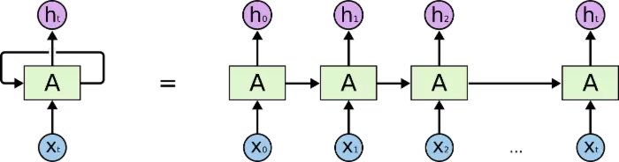
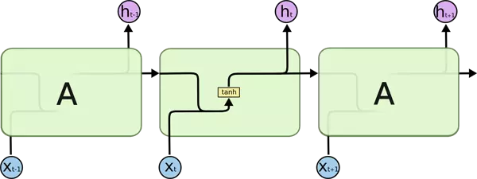

# RNN

> 参考链接: [循环神经网络（RNN）浅析](https://www.jianshu.com/p/87aa03352eb9)
>
> [循环神经网络(RNN, Recurrent Neural Networks)介绍](https://blog.csdn.net/heyongluoyao8/article/details/48636251)

## RNN循环神经网络

循环神经网络与神经网络之间的差别主要就在于, 能够将上一个时刻的 输出 当做下一个时刻的输入来进行数据处理, 也就是说, 除了 本次的数据输入之外, 其结果还要取决于上次的结果. 如此可以从当前数据追溯到过往的所有数据.

因此: RNN网络和其他网络最大的不同就在于RNN能够实现某种“记忆功能”，是进行时间序列分析时最好的选择。

循环神经网络的作用, 即是, 联系上下文, 根据语境 求解当前 语句表达的真实含义.

等号右边的等价RNN网络中最初始的输入是x0，输出是h0，这代表着0时刻RNN网络的输入为x0，输出为h0，网络神经元在0时刻的状态保存在A中。当下一个时刻1到来时，此时网络神经元的状态不仅仅由1时刻的输入x1决定，也由0时刻的神经元状态决定。以后的情况都以此类推，直到时间序列的末尾t时刻。

而RNN网络的神经元结构简化图如下:

可以看到，原始的RNN网络的内部结构非常简单。神经元A在t时刻的状态仅仅是t-1时刻神经元状态与t时刻网络输入的双曲正切函数的值，这个值不仅仅作为该时刻网络的输出，也作为该时刻网络的状态被传入到下一个时刻的网络状态中，这个过程叫做RNN的正向传播(forward propagation).

为什么RNN网络的激活函数要选用双曲正切而不是sigmod呢？（RNN的激活函数除了双曲正切，RELU函数也用的非常多）原因在于RNN网络在求解时涉及时间序列上的大量求导运算，使用sigmod函数容易出现梯度消失，且sigmod的导数形式较为复杂。事实上，即使使用双曲正切函数，传统的RNN网络依然存在梯度消失问题，无法“记忆”长时间序列上的信息，这个bug直到LSTM上引入了单元状态后才算较好地解决。

下图是RNN网络的完整拓扑图:

上图表明了RNN网络的完整拓扑结构，从图中我们可以看到RNN网络中的参数情况。

1. st 为隐藏层的第t步的状态，它是网络的记忆单元。 st根据当前输入层的输出与上一步隐藏层的状态进行计算。

    

    其中, φ 一般是非线性的激活函数, 如在上文提到的 [tanh(双曲正切)](https://baike.baidu.com/item/%E5%8F%8C%E6%9B%B2%E6%AD%A3%E5%88%87?fromtitle=tanh&fromid=19711736), 又或者是 [ReLU](https://baike.baidu.com/item/ReLU%20%E5%87%BD%E6%95%B0/22689567?fr=aladdin). 在计算s0时，即第一个单词的隐藏层状态，需要用到s−1，但是其并不存在，在实现中一般置为0向量；

2.  t时刻的网络状态st不仅仅要输入到下一个时刻t+1的网络状态中去，还要作为该时刻的网络输出。当然，st不能直接输出，在输出之前还要再乘上一个系数V，而且为了误差逆传播时的方便通常还要对输出进行归一化处理，也就是对输出进行softmax化。因此，t时刻网络的输出ot表达为如下形式：

    

3. 需要注意的是:

    你可以认为隐藏层状态st是网络的记忆单元. st包含了前面所有步的隐藏层状态。而输出层的输出ot只与当前步的st有关，在实践中，为了降低网络的复杂度，往往st只包含前面若干步而不是所有步的隐藏层状态；

    在传统神经网络中，每一个网络层的参数是不共享的。
    
    而在RNN中，每输入一步，每一层各自都共享参数U,V,W。其反应着RNN中的每一步都在做相同的事，只是输入不同，因此大大地降低了网络中需要学习的参数；
    
    这里并没有说清楚，解释一下，传统神经网络的参数是不共享的，并不是表示对于每个输入有不同的参数，而是表示在 每一层之间的 U 是不相同的, 比如 Xt到St之间的U矩阵  与  Xt+1到St+1之间的U是不同的，而RNN中的却是一样的，而VW 也是同理.

简化表述方式:

而我们往往会以其代价函数作为最终求解目标, 而最终要求解的值, 也就是参数值. UVW.

只要我们得到了模型的U，V，W这三个参数就能完全确定模型的状态。因此该优化问题的优化变量就是RNN的这三个参数。顺便说一句，RNN模型的U，V，W三个参数是全局共享的，也就是说不同时刻的模型参数是完全一致的，这个特性使RNN得参数变得稍微少了一些。

### CostFunction

RNN的CostFunction 选取的是交叉熵.

y_i是真实的标签值，y_i*是模型给出的预测值，最外面之所以有一个累加符号是因为模型输出的一般都是一个多维的向量，只有把n维损失都加和才能得到真实的损失值。交叉熵在应用于RNN时需要做一些改变：首先，RNN的输出是向量形式，没有必要将所有维度都加在一起，直接把损失值用向量表达就可以了；其次，由于RNN模型处理的是序列问题，因此其模型损失不能只是一个时刻的损失，应该包含全部N个时刻的损失。

故应该是如下形式:

全局损失如下:

yt是t时刻输入的真实标签值，ot为模型的预测值，N代表全部N个时刻。

### BPTT

在以往的 神经网络的求解中, 计算的方法是, 反向传播.  由于RNN模型与时间序列有关，BPTT的全称是“随时间变化的反向传播算法”（back propagation through time）。

需要意识到的是，在vanilla RNNs训练中，BPTT无法解决长时依赖问题(即当前的输出与前面很长的一段序列有关，一般超过十步就无能为力了)，因为BPTT会带来所谓的梯度消失或梯度爆炸问题. 如LSTM便是专门应对这种问题的

> 参考链接: [深度学习 | 梯度消失和梯度爆炸的原因](https://www.jianshu.com/p/243ab5aff906)

这个方法的基础仍然是常规的链式求导法则.

全局损失关于U，V，W三个参数的梯度公式为:

可以采用梯度下降法进行计算:

其中 η 则可以控制 梯度下降的更新速率.

> 参考链接: [RNN - LSTM - GRU](https://zhuanlan.zhihu.com/p/60915302)

在参考连接中, 提到了 RNN之所以会产生梯度爆炸 或 梯度消失的原因.

### 梯度爆炸的解决办法

1. Truncated Backpropagation through time：每次只 BP 固定的 time step 数，类似于 mini-batch SGD。缺点是丧失了长距离记忆的能力。

2. Clipping Gradients： 当梯度超过一定的 threshold 后，就进行 element-wise 的裁剪，该方法的缺点是又引入了一个新的参数 threshold。同时该方法也可视为一种基于瞬时梯度大小来自适应 learning rate 的方法.

    > 梯度裁剪参考链接: 
    > 
    > [梯度爆炸的解决办法：clip gradient](https://blog.csdn.net/u010814042/article/details/76154391)
    > [TensorFlow中的梯度裁剪（Gradient Clipping）](https://blog.csdn.net/jetFlow/article/details/80161354)

    需要注意的是, 并非仅仅会在标准的RNN算法中遇到梯度爆炸.

3. 使用 LSTM、GRU等升级版 RNN，使用各种 gates 控制信息的流通。

4. 在这篇论文 (https://arxiv.org/pdf/1602.06662.pdf) 中提出将权重矩阵 W 初始化为正交矩阵。正交矩阵有如下性质： ， 正交矩阵的特征值的绝对值为1。证明如下， 对矩阵A有：

    

5.  反转输入序列。若使用正常序列输入，则输入序列的第一个词和输出序列的第一个词相距较远，难以学到长期依赖。将输入序列反向后，输入序列的第一个词就会和输出序列的第一个词非常接近，二者的相互关系也就比较容易学习了。

    > [Seq2Seq模型概述](https://www.jianshu.com/p/b2b95f945a98)

6. LSTM 中引入了门控机制来控制信息的累计速度，包括有选择地加入新的信息，并有选择地遗忘之前累计的信息

## 改良RNN

种类比较多, 目前只列举几种我比较关心的.

1. GRURNN

    GRUs也是一般的RNNs的改良版本，主要是从以下两个方面进行改进。一是，序列中不同的位置处的单词(已单词举例)对当前的隐藏层的状态的影响不同，越前面的影响越小，即每个前面状态对当前的影响进行了距离加权，距离越远，权值越小。二是，在产生误差error时，误差可能是由某一个或者几个单词而引发的，所以应当仅仅对对应的单词weight进行更新。

2. LSTM

    这也是我接下来要重点关注的部分.

