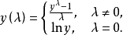
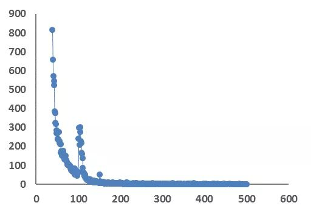
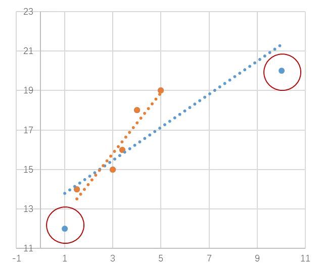
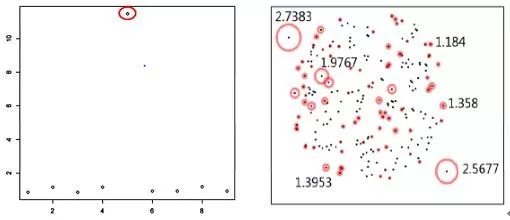
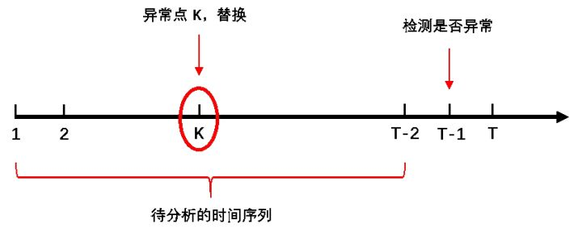

# 异常检测

>参考: [关于数据的异常检测](https://zhuanlan.zhihu.com/p/65023844)

## 检测方法

### 概率统计模型

概率给出总体的分布来推断样本性质，统计则从样本出发来验证总体分布的假设。所以概率统计模型需要我们去验证模型假设的正确性，比如概率分布是否正确，参数的设置是否合理。

### 机器学习方法

机器学习无外乎监督、非监督以及半监督学习方法等，比如常见的聚类，二分，回归。此类方法往往注重模型的泛化能力，而弱化概率统计中的假设检验。

历史数据的异常如果已标注，那么二分类方法是适用的，但业务数据的异常大多没有显示的人工标注，无法应用监督学习。

>> 就这一点而言, 如果没有标注, 我们是不是可以进行批量标注, 然后应用机器学习方法, 进行处理? 因为在目前的数据中, 我们好像是有能力做到这一点的.

### 业务经验，逻辑规则

业务经验的丰富以及对数据的敏感性能更加直接地帮助理解异常数据，在一些轻量级的任务中，配置简单的逻辑规则也能达到很好的检测效果。

>> 这一点就偏向于目前项目中 已经有的 监控项 标准定义. 给定了什么叫做异常, 与崩溃的 概念. 但是在流量数据中, 又不是非常确定是否有明确的 定义.
>> 
>> 同样的, 虽然是缺少真实数据, 但是是否可以通过伪造真实数据的方式, 提供一定量的数据集? 毕竟我们已经知道, 在何种情况下为异常.

### 判定规则

异常值的判定规则主要采用以下两种方式：

1. 区间判定

    给出一个阈值区间，实际观测落在区间之外则判定为异常。例如，在时间序列和回归分析中，预测值与真实值的残差序列便可构建这样一个区间。

    >> 而目前在项目中所应用的方法正是这个方法, 不过有所不同的是, 构建预测值与真实值的残差,

2. 二分判定

    二分判定的前提是数据包含人工标注。异常值标注为1，正常值标注为0，通过机器学习方法给出观测为异常的概率。

### 小结

就以上来说, 目前在项目中判定异常有两种可行方式, 一种是通过人为标记的方式, 另一种则是区间判定, 给出上下基线, 超出阈值则为异常.

>> 但 目前项目中采取的这种方式问题较大, 因为在当前数据集中  不知道 什么是异常数据的情况下, 唯一的策略就是 离群点检测. 也就是, 已经认可了数据中, 大多数 数据都是正常值, 才能够通过这种方式进行处理.

## 实际应用

### 3 Sigma准则

在正态分布中σ代表标准差,μ代表均值。x=μ即为图像的对称轴.

3σ原则为:

数值分布在（μ-σ,μ+σ)中的概率为0.6826.

数值分布在（μ-2σ,μ+2σ)中的概率为0.9544.

数值分布在（μ-3σ,μ+3σ)中的概率为0.9974

可以认为，Y 的取值几乎全部集中在（μ-3σ,μ+3σ)]区间内，超出这个范围的可能性仅占不到0.3%.

3σ准则是建立在正态分布的等精度重复测量基础上而造成奇异数据的干扰或噪声难以满足正态分布.如果一组测量数据中某个测量值的残余误差的绝对值 νi＞3σ,则该测量值为坏值,应剔除.通常把等于 ±3σ的误差作为极限误差,对于正态分布的随机误差,落在 ±3σ以外的概率只有 0.27%,它在有限次测量中发生的可能性很小,故存在3σ准则.3σ准则是最常用也是最简单的粗大误差判别准则,它一般应用于测量次数充分多( n ≥30)或当 n＞10做粗略判别时的情况.

但实际数据往往并不严格服从正态分布。它们判断异常值的标准是以计算数据批的均值和标准差为基础的，而均值和标准差的耐抗性极小，异常值本身会对它们产生较大影响，这样产生的异常值个数不会多于总数0.7%。显然，应用这种方法于非正态分布数据中判断异常值，其有效性是有限的。

> 然而, 正态分布的参数μ和σ极易受到个别异常值的影响，从而影响判定的有效性，因此又产生了Tukey箱型图法。
>
> 同时, 基于正态分布的3σ法则或z分数方法是以假定数据服从正态分布为前提的.

### Tukey箱型图法

箱形图最大的优点就是不受异常值的影响，能够准确稳定地描绘出数据的离散分布情况，同时也利于数据的清洗。

箱型图描述:

五大因“数”:

我们一组序列数为例：12，15，17，19，20，23，25，28，30，33，34，35，36，37讲解这五大因“数”

1. 下四分位数Q1

    a. 确定四分位数的位置。Qi所在位置,i *（n+1）/4，其中i=1，2，3。n表示序列中包含的项数。

    b. 根据位置，计算相应的四分位数。

    例中：

    Q1所在的位置= 1 *（14 + 1）/ 4 = 3.75，

    3.75 可以拆分为 3 + 0.75, 因此, 值应该由第三四项来决定, 其中 3 的权值 是 0.25, 四的权值是 0.75, 因此有:

    Q1= 第三项 * 0.25 + 第四项 * 0.75 = 0.25 × 17 + 0.75 × 19 = 18.5；

2. 中位数（第二个四分位数）Q2

    Q2所在的位置自然是: 2 * (14 + 1) / 4 = 7.5

    自然应该是第七八项计算, 其权值均为0.5, 因此有:

    Q2 = 0.5 × 第七项 + 0.5 × 第八项 = 0.5 × 25 + 0.5 × 28 = 26.5

3. 上四分位数Q3

    同上:

    Q3 所在的位置是: 3 * (14 + 1) / 4 = 11.25

    Q3 = 0.75 × 第十一项 + 0.25 × 第十二项 = 0.75 × 34 + 0.25 × 35 = 34.25

4. 上限

    上限是非异常范围内的最大值。

    首先要知道什么是四分位距如何计算的？

    四分位距IQR = Q3- Q1，那么上限 = Q3 + 1.5IQR

5. 下限

    下限是非异常范围内的最小值。

    下限 = Q1 - 1.5IQR

自然, 异常值的判定就是超过上限, 低于下限的数据.

优点在于:

箱形图的绘制依靠实际数据，不需要事先假定数据服从特定的分布形式，没有对数据作任何限制性要求，它只是真实直观地表现数据形状的本来面貌；另一方面，箱形图判断异常值的标准以四分位数和四分位距为基础，四分位数具有一定的耐抗性，多达25%的数据可以变得任意远而不会很大地扰动四分位数，所以异常值不能对这个标准施加影响，箱形图识别异常值的结果比较客观。

对于标准正态分布的样本，只有极少值为异常值。异常值越多说明尾部越重，自由度越小（即自由变动的量的个数）；

而偏态表示偏离程度，异常值集中在较小值一侧，则分布呈左偏态；异常值集中在较大值一侧，则分布呈右偏态。

由此可见，箱形图在识别异常值方面有一定的优越性。

局限性:

不能精确地衡量数据分布的偏态和尾重程度；对于批量比较大的数据，反映的信息更加模糊以及用中位数代表总体评价水平有一定的局限性。

>> 就以上两种方法来说, 正态分布的前提, 是数据拥有正态分布的特征. 但就我们的数据而言, 在同一周期上 具有 正态分布的特征. 举例来说, 当周期为一周时, 则在长时间的, 每周二的数据, 是大概率满足正态分布的.
>> 
>> 而我们当前使用的确定上下基线的方式正是 正态分布.

> 在实际应用上，常考虑一组数据具有近似于正态分布的概率分布。若其假设正确，则约68.3%数值分布在距离平均值有1个标准差之内的范围，约95.4%数值分布在距离平均值有2个标准差之内的范围，以及约99.7%数值分布在距离平均值有3个标准差之内的范围。称为“68-95-99.7法则”或“经验法则”。

>> 
>> 而 我们计算的方式 正是 选取了 95%的置信区间, 所对应的值 正是平均值 加减 标准差的 1.96倍, 也就是说, 在我们目前所采取的的模型计算中, 是以 95% 作为分割线的.
>> 
>> 而在 3Sigma中, 则是以 99.7% 作为之心区间的. 这一点, 可以作为优化调整的方向.

### 正态分布

> 参考: [SPSS和SAS常用正态检验方法](http://blog.sina.com.cn/s/blog_65efeb0c0100htz7.html)

无论采取以上哪种方式, 都需要数据拥有正态分布的特征, 而 箱型图的方法, 则是进一步减小了异常值对数据统计的影响.

但依然难以绕开根本性的问题, 数据是正态分布的.

检验的方式有多种多样, 原理较复杂, 不去仔细探究, 而这些种种校验方法, 在一部分语言中 也已经有了相应的实现方法.

常用的检验方法有, Shapiro-Wilk检验、Kolmogorov-Smirnov检验、Anderson-Darling检验, Ryan-Joiner检验.

SPSS&SAS规则：

SPSS 规定:当样本含量3 ≤n ≤5000 时,结果以Shapiro - Wilk (W 检验) 为难,当样本含量n > 5000 结果以Kolmogorov - Smirnov 为准。

而SAS 规定:当样本含量n ≤2000 时,结果以Shapiro - Wilk (W 检验) 为准,当样本含量n >2000 时,结果以Kolmogorov - Smirnov (D 检验) 为准。

>> 在这里是否是我们的需要有 大于5000个周期数据, 才需要选取 ks检验?
>> 
>> 因此也是无法确定, 究竟数据是否是符合正态分布的? 如果按照周作为统计度量单位的话, 至少需要一两年的数据, 才能够做校验. 才能够确定数据是否符合正态.
>>
>> 因此在大多数情况下, 我想还是直接默认数据是符合正态分布的比较好.

### box-cox变换

如果数据不满足正态变换, 则需要经过一定的数据处理, 使得其满足正态分布. 

式中y(λ)为经Box-Cox变换后得到的新变量，y为原始连续因变量, λ为变换参数。以上变换要求原始变量y取值为正，若取值为负时，可先对所有原始数据同加一个常数a使其(y + a)为正值，然后再进行以上的变换。

对不同的所作的变换不同。在λ=0时该变换为对数变换，λ=-1时为倒数变换，而在λ=0.5时为平方根变换。Box-Cox变换中参数的λ估计有两种方法：(1)最大似然估计；(2)Bayes方法。通过求解λ值，就可以确定具体采用哪种变换形式。

Box-Cox变换的一个显著优点是通过求变换参数来确定变换形式，而这个过程完全基于数据本身而无须任何先验信息，这无疑比凭经验或通过尝试而选用对数、平方根等变换方式要客观和精确。

> Box-Cox变换的目的是为了让数据满足线性模型的基本假定，即线性、正态性及方差齐性，然而经Box-Cox变换后数据是否同时满足了以上假定，仍需要考察验证

### 片段小结

>> 通过如上我们知道了 可以通过 W 检验 或 KS 检验来校验数据是否符合正态分布, 可以通过 box-cox变换, 将数据经过一定的处理, 使其满足正态分布. 同时, 在调整之后, 依然要校验, 是否符合正态分布.
>>
>> 如果数据符合正态分布, 则可以通过 箱型图, 或是 3Sigma的方式 来求取异常值, 以及 求取阈值.

### 幂律分布

除了常见的正态分布，还有一种极其重要却极易被忽略的分布-幂律分布。在日常的数据分析中，订单数据和浏览数据常呈现近似幂律分布。

下图展现的是社交网络中用户数和用户粉丝数的关系，可以看出拥有200（横轴）以上的粉丝的用户数（纵轴）占极少数，而拥有<100粉丝的用户数成百上千，这就是幂律分布的特点：少数群体占有着多数的资源。

呈现幂律分布特点的数据可通过log转换使观测点近似其分布在一条直线上，方便后续分析和预测，而分布中的那些所谓的“极端值”却不能像分析正态分布那样随意的剔除。考虑到计算中数据的倾斜问题，在不影响整体效果的情况下，可根据更加细致的分位点对极端值进行取舍。

>> 而我们的数据则没有这样的特点, 数据倾向于是正态分布的. 不过是 周期性的正态分布.

### 回归分析

回归分析 也可以用来 查找异常值.

原因在于: 在回归分析中，尤其是线性回归中，异常的数值也会对模型的拟合效果产生较大的影响。

对图中7个数据点进行拟合，蓝色的回归曲线线受到右上方高杠杆值的影响，偏向了它，拟合并不理想。对高杠杆值的识别不足以用来检测回归中的异常，更有效的方式是计算每个数据点的Cook距离。

Cook距离表征了:

包含此观测点和剔除此观测点

前后模型的拟合效果的差别.

差别越大，此点对模型影响越大，可考虑删除，因为在一个稳健的模型中每个点对模型的影响都认为是均匀的。删除强影响点之后，橘色的曲线对大部分的点的拟合都比较满意。

因此cook值越大, 数据是异常数据的概率越高.

### 基于密度的方法

在一维空间中的固有思维是较大或较小的数据会是异常，但是在高维空间中，数据是不能直接拿来比较大小的。仍以一维数据为例，考虑以下序列的异常情况：

｛1，2，3，2，50，97，97，98，99｝

50更有可能认为是异常或离群点，而非1或99。当数据分布的假设不是必要条件时，计算数据点的密度来判定异常也是一个行之有效的方法。

点的密度可有多种定义，但多数都会依赖距离的定义，多维空间的距离计算较为复杂，尤其当数据混入分类变量和连续数值变量的时候。以一个简单的密度方法为例，在LOF（Breunig,M., Kriegel, H., Ng, R., and Sander, J. (2000). LOF:identifying density-based local outliers.）算法中，数据的异常判定依赖于计算每个观测的局部离群因子。

离群因子表征了数据点与周围邻居点的密切程度，或者不合群的程度。因子值越大，其为异常点的可能性越大。

上述一维序列的各点离群因子值如下左图，第5个点（50）对应的离群因子最高，可被判定是异常值。下右图是维基百科上一个二维空间的例子，根据局部离群因子同样可以识别出数据中的离群点。

### 业务数据的时序监控

业务数据的时序监控是对各业务线产生的时序数据，如访问量，订单量等进行异常检测，是对业务正常开展的反馈与保障。业务数据包含实时数据和离线数据，对实时性要求不高可采用T+1天监控预警。在实践中发现业务数据会有如下特点：

1. 数据稀疏：有的业务数据时间跨度小，历史数据不足；有的业务数据包含缺失值，时间不连续，通常会出现在投放业务中。

2. 无人工标注：历史的异常值无人工标注，后续判断异常主观性较强。

3. 节假日等影响因素不可控。

常用的判定流程如下：

T时刻基于[1, T-2]时间段内的数据建立模型或规则来判定T-1时刻数据的是否异常。为了保证规则和模型的稳健，对于历史的异常值往往会采用平滑的方式处理。

a. 配置恒定阈值

数据无趋势性，近似平稳，可配置简单的恒定阈值。时刻T配置的恒定阈值是对历史数据的恒定，在T+1时刻，这个阈值会被新加入的数据更新。

b. 配置动态阈值

如果时间序列含有趋势性，但无明显周期性，可以配置动态阈值。比如基于固定的移动窗口计算移动平均值和移动标准差，基于两者给出监控的上下界。动态阈值会受到移动窗口大小设定的影响，对判定当前数据异常有一定的延迟性。

c. 监控差分序列

对原始序列作一阶差分，如果差分序列稳定，可对差分序列配置恒定阈值，从而判定原序列的异常情况。

d. 时间序列分解法

如果业务数据既有趋势性又有周期性，可将时间序列模型运用于监控任务中，如Arima，STL，TBATS等时间序列模型。在STL鲁棒加权回归时间序列分解法中，模型通过加权最小二乘回归将原始序列分解成周期序列，趋势序列和残差序列。下图从上到下依次是原始序列，周期序列，趋势序列和残差序列。

模型基于残差序列的中位数和观测的残差值赋予每个观测一个稳健权重，权重低的观测会被判定为异常。这里之所以使用残差序列的中位值，也是考虑了中位值的稳健性。

在实际应用中会发现，业务时序数据的不规则和特点的多变性往往对模型和规则提出更高的要求，不同的检测方法需要相互配合使用才能发挥作用。

### 小结

主要可以分为有监督和无监督的异常检测方法。

有监督的方法将异常检测转化为二分类问题，正常数据为一个类，异常数据为一个类。这样可以直接利用现成的分类方法。但是需要人工标记异常数据，在许多实际应用中往往不太现实。

无监督的方法相对比较实用，主要分为三类：

1. 基于规则的方法，如3 \sigma 准则。

2. 基于聚类的方法，将数据聚为多个类，如果某个数据和类中心都比较远，则该数据为异常，或是将数据量少于某个阈值的类中所有数据认为是异常。(离群点检测)

3. 基于重建的方法，这类的方法主要基于auto-encoder (AE)或variational auto-encoder (VAE)。先训练一个模型，得到数据的隐空间。对于测试数据，若该数据的重建误差较大，说明该数据不能和其他数据的分布吻合，即为异常数据。

除了之前小结过的 3Sigma, 需要关注的方法是, 离群点检测, 以及多维离群点检测的方法 可能对于我们目前的需求更为重要. 

同时, 在时序数据中的平滑处理 也很关键.  可以尝试通过将不同的固定值 给定为 固定阈值的方式, 通过这种方式, 调整固定阈值, 求解模型预测值 与 实际值之间的 误差. 通过这种方式, 可以使得模型更为完善.

其次, 就是 时间序列分解法, 也是一种非常不错的方式.

因为 我们的数据 虽然不具有趋势性, 但是具有很强的周期性, 将数据转为 周期性数据之后, 再度拟合模型 也是不错的方式.

>> 值得一提的是, 在时序数据中, 使用一元高斯分布 已经足够, 而当给定的变量, 或说更多的特征值时, 此时, 就需要, 多元高斯分布 上场.
>> [多元高斯分布](https://zhuanlan.zhihu.com/p/58987388)
>> [异常检测](https://www.jianshu.com/p/56a608f58f05)

> 其他参考链接:
> 
> [java实现时序数据异常检测(离群点检测方法)](https://www.jianshu.com/p/ec40dd7b6b37)

> 开源工具: [https://github.com/Microsoft/TagAnomaly](https://github.com/Microsoft/TagAnomaly)

