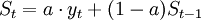
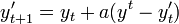

# 指数平滑法

> 参考: [指数平滑法](https://wiki.mbalib.com/wiki/%E6%8C%87%E6%95%B0%E5%B9%B3%E6%BB%91%E6%B3%95)

指数平滑法是布朗(Robert G..Brown)所提出，布朗(Robert G..Brown)认为时间序列的态势具有稳定性或规则性，所以时间序列可被合理地顺势推延；他认为最近的过去态势，在某种程度上会持续到最近的未来，所以将较大的权数放在最近的资料。

指数平滑法是生产预测中常用的一种方法。也用于中短期经济发展趋势预测，所有预测方法中，指数平滑是用得最多的一种。

简单的全期平均法是对时间数列的过去数据一个不漏地全部加以同等利用；

移动平均法则不考虑较远期的数据，并在加权移动平均法中给予近期资料更大的权重；

而指数平滑法则兼容了全期平均和移动平均所长，不舍弃过去的数据，但是仅给予逐渐减弱的影响程度，即随着数据的远离，赋予逐渐收敛为零的权数。

也就是说指数平滑法是在移动平均法基础上发展起来的一种时间序列分析预测法，它是通过计算指数平滑值，配合一定的时间序列预测模型对现象的未来进行预测。其原理是任一期的指数平滑值都是本期实际观察值与前一期指数平滑值的加权平均。

指数平滑法的基本公式是：

* St--时间t的平滑值；
* yt--时间t的实际值；
* St − 1--时间t-1的平滑值；
* a--平滑常数，其取值范围为[0,1]；

由该公式可知：

1. St是yt和 St − 1的加权算数平均数，随着a取值的大小变化，决定yt和 St − 1对St的影响程度，当a取1时，St = yt；当a取0时，St = St − 1。

2. St具有逐期追溯性质，可探源至St − t + 1为止，包括全部数据。
   
   其过程中，平滑常数以指数形式递减，故称之为指数平滑法。
   
   指数平滑常数取值至关重要。平滑常数决定了平滑水平以及对预测值与实际结果之间差异的响应速度。
   
   平滑常数a越接近于1，远期实际值对本期平滑值影响程度的下降越迅速；平滑常数a越接近于 0，远期实际值对本期平滑值影响程度的下降越缓慢。
   
   由此，当时间数列相对平稳时，可取较大的a；当时间数列波动较大时，应取较小的a，以不忽略远期实际值的影响。生产预测中，平滑常数的值取决于产品本身和管理者对良好响应率内涵的理解。

据平滑次数不同，指数平滑法分为：一次指数平滑法、二次指数平滑法和三次指数平滑法等。

其:

当时间数列无明显的趋势变化，可用一次指数平滑预测。

公式为指数平滑法的基本公式, 其变形公式为:

二次指数平滑是对一次指数平滑的再平滑。它适用于具线性趋势的时间数列。

三次指数平滑预测是二次平滑基础上的再平滑。

总结来说:

一次指数平滑法针对没有趋势和季节性的序列，二次指数平滑法针对有趋势但没有季节性的序列，三次指数平滑法针对有趋势也有季节性的序列。“Holt-Winters”有时特指三次指数平滑法。

其中我们项目中使用的就是三次指数平滑法:

其中， pi 是指“周期性”部分。预测公式如下：

问题或说局限性在于:

指数平滑法, 始终估算的是 对纯粹的时间序列的数据. 并不能接收更多的特征值.

要想加入更多的特征值参数, 需要使用 LSTM.

> 参考: [教你搭建多变量时间序列预测模型LSTM（附代码、数据集）](https://yq.aliyun.com/articles/235901)

