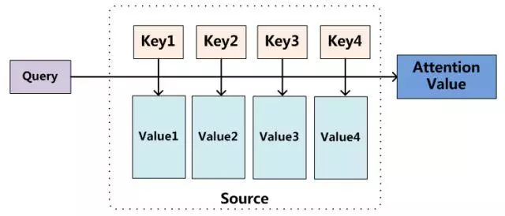

# 注意力模型

> 参考链接: [深度学习中的注意力模型](https://www.jianshu.com/p/d9c0f34e24fc)

抛去复杂的原理, 过程梳理. 注意力模型 简要概括就是:

从概念上理解，把Attention仍然理解为从大量信息中有选择地筛选出少量重要信息并聚焦到这些重要信息上，忽略大多不重要的信息.

至于如何衡量信息的重要程度? 则是通过 权重系数的计算上，权重越大越聚焦于其对应的Value值上，即权重代表了信息的重要性，而Value是其对应的信息。

核心在于 对于 源数据中的 数据元素 进行拆解, 在求取结果时, 不同的元素所占用的权重有所不同. 

在 自然语言翻译, 语音翻译, 图像识别等方面会起到比较良好的效果.

但对于时序性数据预测, 可能效果就不如LSTM来的明显.

