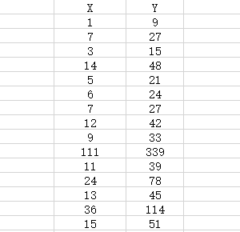
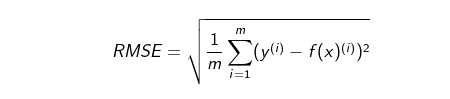
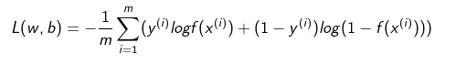
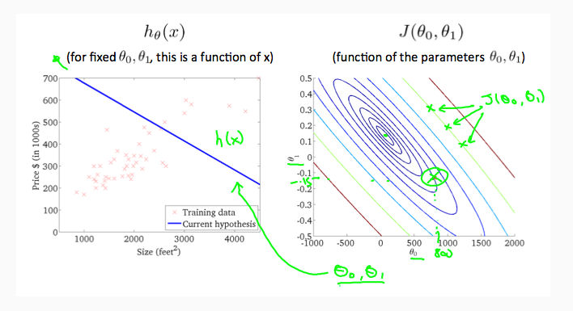
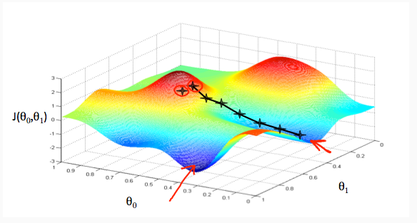
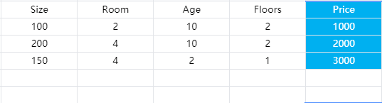
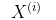
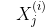

# 机器学习入门

就个人而言, 是学习了 吴恩达的 机器学习系列. 记录了相应的笔记, 在当时有很多不解的地方暂时搁置, 如今再回头去看, 问题已经不是问题.

也因此, 对知识内容加以梳理, 分享.

相应的视频在网易云就有, 也无需翻墙, 只是少了课后习题而已.

## 机器学习

机器学习是对数据集的处理, 应用, 从中总结出来种种可以理解, 或人类无法理解的 规律性, 进而通过这种 规律性, 对未来的数据加以预测.

而机器学习的目的, 自然是为了进行预测, 自然而然的, 我们会期待其准确度 随着 数据量的增多, 算法的改进 等等 而提升.

### 分类

机器学习主要分为两大类, 一种是监督学习, 一种是无监督学习.

A. 监督学习, 对于训练集中的每一条数据都有与之相匹配的唯一答案， 也即正确答案。 所以一个明显的特点是，对于监督学习，其结果的正确性是可判断的，可预见的， 并不存在一些似是而非的 双重答案。

举例来说, 对于已有的数据集, 每一个已经出售的  房子的 基本属性 作为输入数据, 比如 房子的面积, 地理位置, 出售时间. 而价格作为其输出.

不难理解, 对于每一条输入数据 都有一条 输出数据与之相对应, 并且是唯一确定的, 并不能说 它的价格 既可以是 又可以是.

#### 情境算法
•  回归：也即线性回归，多项或是单项，单次或是二次甚至更高，其特点是 结果集是连续值。

•  分类：特点是， 对于数据集 可能会有多个影响结果的因子， 但就结果本身，是有限的，不连续的。 如 对于一场游戏比赛，我们知道其结果只有两种， 并非连续的。 但对于一场正在进行的比赛，我们也知道 其胜率 是连续值，并非 有限的。

需要注意, 这里的回归问题, 与后面要谈到的线性回归算法有所不同. 对其结果而言 是连续的无穷的值, 是其特征. 而与具体的某种算法无关.

B. 无监督学习

对于无监督学习算法而言， 对于给定的训练集，并没有与之相匹配的结果，或所谓的 正确答案。但这仅仅是从训练集的角度进行划分。并且对于训练集，我们无法确定可能会影响结果的指标项究竟有什么。

但没有结果并不意味着不存在真实可靠的结果，对于算法得出的分类 结果，必然是能够以标准进行评判的，能够知道 是对 是错。 所以， 在训练集已经有了计算结果之后，再进行人为的评价，判断， 而形成新的训练集， 此时， 就成为了 监督学习算法中的 分类算法。

比如:

聚类算法(Cluster algorithm): 根据所给的数据集，自动将其划分为不同的 集合， 自动进行分类， 比如给出一批简历，自动将其划分档次，并可以通过这种档次 定位不同的推荐级别。

## 线性回归

在此之前, 需要提到的是 我们当前所探讨的数据集特征.

也即训练集, 一般来说是 形如如下格式的数据.

数据集分为 X 表述输入, Y 表示输出, 对于每一个X 都有一个Y与之对应.  往往, 我们的目标是 给定 一个 新的 X 预测其相应的 Y值.

我们要做的, 就是发现 X 和 Y之间的关系, 在机器学习中, 往往不会在乎这关系究竟有多复杂, 参数有多么大或多么小, 多么难以计算, 而是确定两者之间是有关系的,  并可以根据参数来进行新的预测, 且达到比较好的效果.

摆在面前的第一个问题就是, 我通过"猜"的方式, 找到了两者之间的对应关系, 当然, 可能准确也可能不准确. 那么该怎样衡量准确程度呢? 如果有偏差, 又该如何评比两种 参数之间, 哪种更接近真实情况一点呢?

这就不得不提到这样几个概念:

> 参考链接: [几种常见的损失函数](https://www.cnblogs.com/lliuye/p/9549881.html)

a. 损失函数(loss function)

损失函数 是定义在单个样本上的，是指一个样本的误差.  假定 我们猜测, 对于上述数据, 其 X 和 Y之间的关系是 Y = 5 + X

那么对于第一条数据, 我们不难验证, 根据我们猜测的关系(也可以称之为模型)来看, 给定 X = 1, 则 Y' = 1 + 5 = 6, 而真实值是 9, 两者之间相差3.

那么可以这样定义, Y' 是根据当前关系 预测 出来的 值, Y 是对应当前X 其真实值, 则 loss = Y' - Y, 两者之间的差异越大, 说明 对于当前数据而言, 模型越不可靠.

当然损失函数的定义多种多样,  在线性回归中, 使用到的则是 平方损失函数. 

b. 代价函数(cost function)

对于单个样本来说, 其偏差 可以用 损失函数来衡量, 但对于大量数据而言, 我们的关注点 不可能仅仅停留在 单个数据的 损失函数变化上, 而需要着眼全局 才能够找到 最贴近真实情况的模型.

此时使用的就是 代价函数. 是定义在整个训练集上的，是所有样本误差的平均，也就是所有损失函数值的平均.

对于全局数据而言, 对于同一模型的 损失函数可能存在大范围波动, 因此可以通过对代价函数取最小值, 来求取最优解.

有这样几种常见的代价函数.

1. 均方误差MSE

均方误差是指参数估计值与参数真值之差平方的期望值; MSE可以评价数据的变化程度，MSE的值越小，说明预测模型描述实验数据具有更好的精确度。（ i 表示第 i 个样本，m 表示样本总数）

通常用来做回归问题的代价函数。

2. 均方根误差(RMSE)

均方根误差是均方误差的算术平方根，能够直观观测预测值与实际值的离散程度。

由于对结果进行了开根号处理, 在保证结果为非负值的前提下, 同时又能够使得误差 和 数据集 处于同一个量级, 因此可以直观观测预测值与真实值的离散程度.

3. 平均绝对误差（MAE）

MAE 看似与 RMSE相同, 但事实上, RMSE是对误差进行了放大处理. 平均绝对误差能更好地反映预测值误差的实际情况。

4. 交叉熵代价函数（Cross Entry）

交叉熵是用来评估当前训练得到的概率分布与真实分布的差异情况，减少交叉熵损失就是在提高模型的预测准确率。其中 p(x) 是指真实分布的概率， q(x) 是模型通过数据计算出来的概率估计。

> 参考: [熵与信息增益](https://blog.csdn.net/xg123321123/article/details/52864830)

对于二分类其 交叉熵代价函数为如下.

其中 f(x) 可以是sigmoid函数。或深度学习中的其它激活函数。
通常用做分类问题的代价函数。

对于线性回归, 其代价函数则可以选取 均方误差, MSE.

单变量线性回归其计算公式如下.

### 求解

不难理解, 对于任意 θ组(θ0, θ1) 都有唯一确定的 f(x) 图像与之对应, 即线性回归的最终拟合的 方程.  这也是我们的最终目的, 找到一条直线, 能够最大程度的和数据集中的数据相重合,  如下图左侧所示.

我们可以直观的通过 观察 h(x) 与图中点的匹配程度, 来发现当前 θ 组其拟合效果如何.

当然, 更需要的是通过定量的方式 来对 θ 效果进行判断. 即在上文提到过的 MSE, 代价函数.

这样我们就将求取最优解的过程, 转换为了求取代价函数的最小值.

在求取代价函数的过程中, 通过不断的改变, 尝试 θ 组, 进而找到, 能够使得 代价函数最小的 θ 组. 

此时, 将 θmin 带入 f(x), 就是我们要的最终结果.

而对于不同的 θ 组, 自然有相应的 J值, 其所绘制的图像 如右图所示. 当然, 只是将3D转换为了2D的等势图.

其3D图像, 如下图所示.

而事实上, 不难发现, 我们有无穷个  θ  组, 难道真的一个个遍历所有值, 然后找到其最最小值吗?

这当然是不现实的.

需要借助梯度下降这个工具.

### 梯度下降

梯度下降, 其直观效果如上图所示.

一个比较形象的描述是, 一个人站在山上, 他无法观测整个山的走势, 因此仅能够根据自己当前所看到的 环境, 来决定自己要走哪个方向.

每走一步, 重复做一次判断, 不断向下, 最终来到最低点.

需要注意到的地方是：可能由于初始所处位置不同， 所以尽管你在每一步都选择了最优解，但依然会偏向两个不同的方向， 这被称作是 局部最优解。这也正是梯度下降算法的特点之一， 因此我们可以选择不同的初始值来进行梯度下降算法。 通常情况下， 会以0 作为所有的初始值进行计算。

那么对于如上图所示的3D图像而言, 又该怎样在当前点 判断究竟是要向哪个方向前进呢?

其核心点在于 导数, 或说 当前点的斜率 

相信对这个概念并不陌生.

因此其计算, 迭代公式如下图:

其中 α  被称为学习速率.

不难发现, α 越大, θ  减小的速率越快.

那么这个迭代过程到什么时候终止呢?

直到 J 小到一个我们满意的程度为止, 你可以设定任何你喜欢的值.

当然, 最理想的值是 0, 当J为0时, 表示结果与数据集完美契合. 但往往是不切实际的.

但必须记住的是 J 越小, 表示我们的拟合结果 对数据集的表达能力越好.

但是这里存在这样一个问题：当α选取过小的时候，求取速率过慢，需要迭代次数过多，甚至导致在有限时间内求取解变成了一个不可能的事情， 而当α选取过大的时候又很有可能导致结果发散，无法收敛，无法得到最小值。

但正如上面提到的, 给定一个初始的 θ, 当次收敛的最终结果 可能只是一个局部最优解. 因此往往需要赋予不同的 θ 初始值, 来进行梯度下降.

特别的:

对于线性回归算法而言， 并不存在局部最优解， 它只有全局最小值。

## 多特征线性回归方程

在上面提到的是 单变量线性回归. 

但其主要思想与多变量线性回归 并无二致.

数据格式大概如下:

前四列是 特征值 x, 最后一列是 对应 y.

有这样几个常用符号:

n 表示特征值数量.

m 表示样本的数量.

 表示第 i 条数据, 比如上图中的 200 4 10 2

 表示第 i 条数据的  第 j个特征值.

