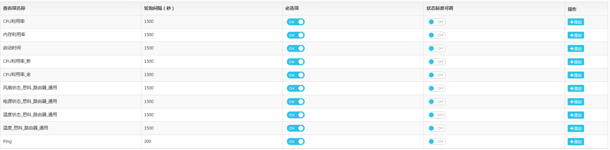
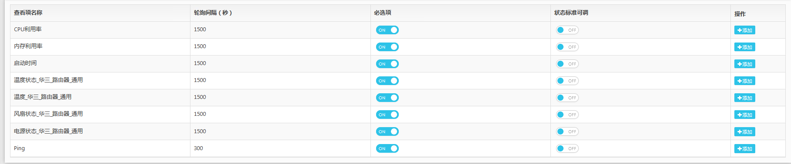
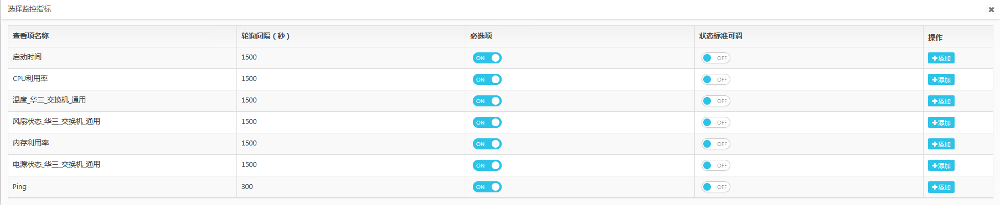
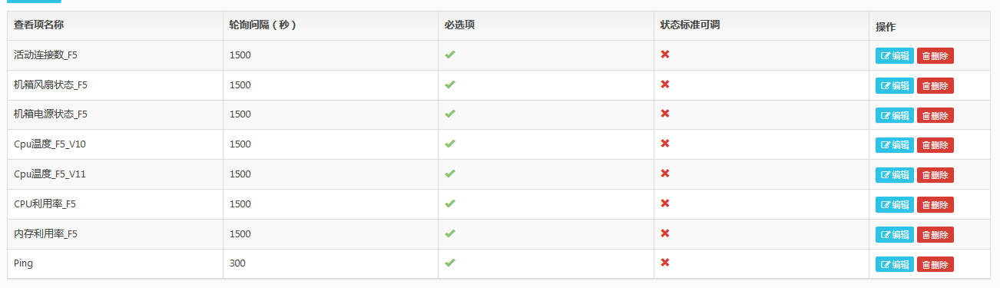
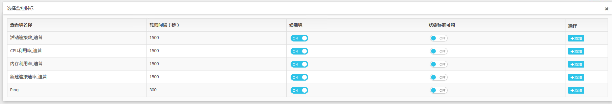
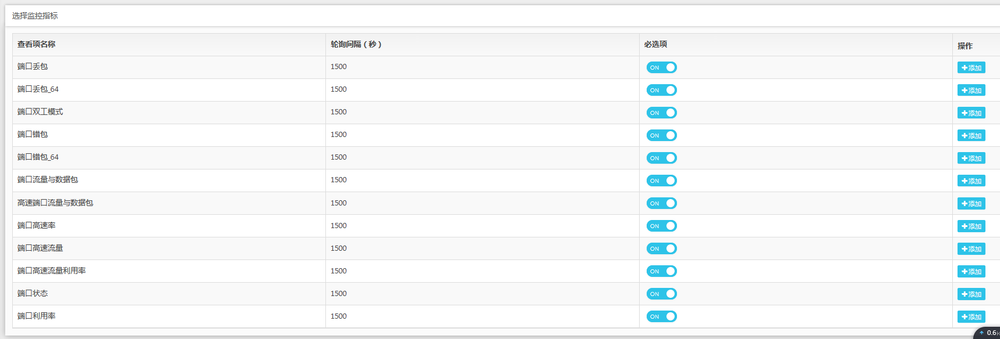

# 根因分析

本篇是根原因分析相关笔记.

## 随想

通常情况下, 都是由于单点故障引起的, 其他模块出错.

最终导致 告警/异常/事件 存在于多个维度. 因此需要找到根本原因, 比如当一台设备出现问题, 最终会导致从各个维度都出现问题, 比如 端口Ping, 设备Ping, BPS, 等等一系列的故障.

通过无监督根原因分析, 未必需要找到真正的根原因, 而是给出用户比例系数, 让其自行判断问题最终落点, 系数越高, 可能性越高.

> [七层协议和四层协议](https://www.cnblogs.com/moonbaby/p/10515236.html)

## 基础知识

### 设备

1. 服务器

    务器是计算机网络上最重要的设备。服务器指的是在网络环境下运行相应的应用软件，为网络中的用户提供共享信息资源和服务的设备。服务器的构成与微机基本相似，有处理器、硬盘、内存、系统总线等.

    服务器是网络的中枢和信息化的核心，具有高性能、高可靠性、高可用性、I/O吞吐能力强、存储容量大、联网和网络管理能力强等特点。

    按应用层次进行划分（入门级、工作组级、部门级、企业级）、按处理器架构进行划分（X86\IA64\RISC）、按服务器的处理器所采用的指令系统划分（CISC\RISC\VLIW）、按用途进行划分（通用型、专用型）、按服务器的机箱架构进行划分（台式服务器、机架式服务器、机柜式服务器、刀片式服务器）等。

2. 中继器

    中继器（RP repeater）是连接网络线路的一种装置，常用于两个(可通信)网络节点之间物理信号的双向转发工作。中继器主要完成物理层的功能，负责在两个节点的物理层上按位传递信息，完成信号的复制、调整和放大功能，以此来延长网络的长度。由于存在损耗，在线路上传输的信号功率会逐渐衰减，衰减到一定程度时将造成信号失真，因此会导致接收错误。中继器就是为解决这一问题而设计的。
    
    它完成物理线路的连接，对衰减的信号进行放大，保持与原数据相同。一般情况下，中继器的两端连接的是相同的媒体，但有的中继器也可以完成不同媒体的转接工作。从理论上讲中继器的使用是无限的，网络也因此可以无限延长。事实上这是不可能的，因为网络标准中都对信号的延迟范围作了具体的规定，中继器只能在此规定范围内进行有效的工作，否则会引起网络故障。

    集线器是有多个端口的中继器。简称HUB

3. 网桥

    网桥工作于OSI体系的数据链路层。所以OSI模型数据链路层以上各层的信息对网桥来说是毫无作用的。所以协议的理解依赖于各自的计算机。

    网桥包含了中继器的功能和特性，不仅可以连接多种介质，还能连接不同的物理分支，如以太网和令牌网，能将数据包在更大的范围内传送。网桥的典型应用是将局域网分段成子网，从而降低数据传输的瓶颈，这样的网桥叫“本地”桥。用于广域网上的网桥叫做“远地”桥。两种类型的桥执行同样的功能，只是所用的网络接口不同。

    > [网桥百度百科](https://baike.baidu.com/item/%E7%BD%91%E6%A1%A5)

    生活中的交换机就是网桥。

4.  路由器

    路由器又可以称之为网关设备。路由器就是在OSI/RM中完成的网络层中继以及第三层中继任务，对不同的网络之间的数据包进行存储、分组转发处理，其主要就是在不同的逻辑分开网络。
    
    而数据在一个子网中传输到另一个子网中，可以通过路由器的路由功能进行处理。在网络通信中，路由器具有判断网络地址以及选择IP路径的作用，可以在多个网络环境中，构建灵活的链接系统，通过不同的数据分组以及介质访问方式对各个子网进行链接。
    
    路由器在操作中仅接受源站或者其他相关路由器传递的信息，是一种基于网络层的互联设备。

    路由表包含有网络地址、连接信息、路径信息和发送代价等。

    路由器比网桥慢，主要用于广域网或广域网与局域网的互连。

    路由器是互联网的主要结点设备。路由器通过路由决定数据的转发。转发策略称为路由选择（routing）

    原理:

    网络中的设备相互通信主要是用它们的IP地址，路由器只能根据具体的IP地址来转发数据。
    
    IP地址由网络地址和主机地址两部分组成。在Internet中采用的是由子网掩码来确定网络地址和主机地址。子网掩码与IP地址一样都是32位的，并且这两者是一一对应的，子网掩码中“1”对应IP地址中的网络地址，“0”对应的是主机地址，网络地址和主机地址就构成了一个完整的IP地址。在同一个网络中，IP地址的网络地址必须是相同的。计算机之间的通信只能在具有相同网络地址的IP地址之间进行，如果想要与其他网段的计算机进行通信，则必须经过路由器转发出去。
    
    不同网络地址的IP地址是不能直接通信的，即便它们距离非常近，也不能进行通信。路由器的多个端口可以连接多个网段，每个端口的IP地址的网络地址都必须与所连接的网段的网络地址一致。不同的端口它的网络地址是不同的，所对应的网段也是不同的，这样才能使各个网段中的主机通过自己网段的IP地址把数据发送到路由器上。

    下图是 思科路由器的所有监控项.

    

    下图是华三路由器所有监控项.

    

5.  网关

    网关(Gateway)又称网间连接器、协议转换器。网关在网络层以上实现网络互连，是复杂的网络互连设备，仅用于两个高层协议不同的网络互连。网关既可以用于广域网互连，也可以用于局域网互连。

    那么网关到底是什么呢？网关实质上是一个网络通向其他网络的IP地址。比如有网络A和网络B，网络A的IP地址范围为“192.168.1.1~192. 168.1.254”，子网掩码为255.255.255.0；网络B的IP地址范围为“192.168.2.1~192.168.2.254”，子网掩码为255.255.255.0。
    
    在没有路由器的情况下，两个网络之间是不能进行TCP/IP通信的，即使是两个网络连接在同一台交换机（或集线器）上，TCP/IP协议也会根据子网掩码（255.255.255.0）与主机的IP 地址作 “与” 运算的结果不同判定两个网络中的主机处在不同的网络里。
    
    而要实现这两个网络之间的通信，则必须通过网关。
    
    如果网络A中的主机发现数据包的目的主机不在本地网络中，就把数据包转发给它自己的网关，再由网关转发给网络B的网关，网络B的网关再转发给网络B的某个主机。网络A向网络B转发数据包的过程。

    路由器则是相应的网关设备, 但路由器的功能又不仅限于网关.

6. 防火墙

    在网络设备中，是指硬件防火墙。

    硬件防火墙是指把防火墙程序做到芯片里面，由硬件执行这些功能，能减少CPU的负担，使路由更稳定。

    防火墙的主要作用是 控制数据的流入流出.

7. 交换机

    基于 我们不可能在所有可以通信的主机之间 建立一条连接.

    它工作在数据链路层..

    交换机拥有一条很高带宽的内部总线和内部交换矩阵。交换机的所有的端口都挂接在这条总线上，控制电路收到数据包以后，处理端口会查找内存中的地址对照表以确定目的MAC（网卡的硬件地址）的NIC（网卡）挂接在哪个端口上，通过内部交换矩阵迅速将数据包传送到目的端口，目的MAC若不存在则广播到所有的端口，接收端口回应后交换机会“学习”新的地址，并把它添加入内部MAC地址表中。 
    
    使用交换机也可以把网络“分段”，通过对照MAC地址表，交换机只允许必要的网络流量通过交换机。通过交换机的过滤和转发，可以有效的隔离广播风暴，减少误包和错包的出现，避免共享冲突。
    
    交换机在同一时刻可进行多个端口对之间的数据传输。每一端口都可视为独立的网段，连接在其上的网络设备独自享有全部的带宽，无须同其他设备竞争使用。当节点A向节点D发送数据时，节点B可同时向节点C发送数据，而且这两个传输都享有网络的全部带宽，都有着自己的虚拟连接。
     
    总之，交换机是一种基于MAC地址识别，能完成封装转发数据包功能的网络设备。交换机可以"学习"MAC地址，并把其存放在内部地址表中，通过在数据帧的始发者和目标接收者之间建立临时的交换路径，使数据帧直接由源地址到达目的地址。

    下图是华三交换机的所有监控项.

    

8. 网卡

    网卡：网络接口卡（NIC）是计算机或其它网络设备所附带的适配器，用于计算机和网络间的连接。每一种类型的网络接口卡都是分别针对特定类型的网络设计的，例如以太网、令牌网、FDDI或者无线局域网。网络接口卡（NIC）使用物理层（第一层）和数据链路层（第二层）的协议标准进行运作。网络接口卡（NIC）主要定义了与网络线进行连接的物理方式和在网络上传输二进制数据流的组帧方式。它还定义了控制信号，为数据在网络上进行传输提供时间选择的方法。

9. 负载均衡设备

    F5 BIG-IP是其中一种 厂商提供的实现.

    目前客户常用的另一种是 迪普厂商提供的.

    通过硬件层面  实现

    应用交付网络（ADN）、服务器负载均衡、链路负载均衡、多站点负载均衡、WEB加速及应用安全、本地流量管理、灾难备份、广域网传输优化、SSL VPN、ISP互访互通、远程安全接入/访问、文件存储虚拟化、多链路接入、远程安全访问。

    目前来看, 主要作用是 负载均衡, 流量控制, 链路容灾.

    下图是F5设备常用监控项.

    

    下图是迪普常用监控项

    

    //TODO
    直观表现, 更像是插入式的设备, 而非独立运行的设备.

从上面的描述来看, 路由器 和 交换机之间的差别并不很大.

交换机主要用于组建局域网，而路由主要功能是将由交换机组好的局域网相互连接起来，或者接入Internet。

交换机能做的，路由都能做, 交换机不能分割广播域，路由可以。

而至于交换机工作在第二层, 路由器工作在第三层这种说法, 并不错误, 不过需要了解下 三层交换机.

交换机更侧重流量, 路由器更侧重 多个子网之间的交互.

路由器实现了不同网络之间的数据转发，交换机实现了特定网络内的数据交换

而交换与转发差别在于:

交换 更倾向于切换, 而转发 则更倾向于 存储转发.

### 路由表

在计算机网络中，路由表（routing table）或称路由择域信息库（RIB, Routing Information Base），是一个存储在路由器或者联网计算机中的电子表格（文件）或类数据库。

路由表存储着指向特定网络地址的路径（在有些情况下，还记录有路径的路由度量值）。

路由表中含有网络周边的拓扑信息。路由表建立的主要目标是为了实现路由协议和静态路由选择。

通过路由表, 决定了从何处来的数据, 要往何处去.

路由表中, 存储了几个关键信息.

1. 目的IP/目的网段

2. 出口

3. 下一跳地址

4. 优先级

5. Cost/度量值 路径开销

路由表数据解释:

1. 出口 NULL0, 表示相应数据会被丢弃
   
2.  目的地址0.0.0.0, 当系统接收到一个目的地址不在路由表中的数据包时，系统会将该数据包通过192.168.99.8这个接口发送到缺省网关192.168.99.1

3.  当系统接收到一个发往目标网段127.0.0.0的数据包时，系统将接收发送给该网段的所有数据包。

> [Windows路由表详解](https://blog.51cto.com/tonyguo/176104)

### MAC表

在链路层, 是通过MAC来标识两端的, 因此在交换机中又存储有MAC表.

### ARP缓存表

在交换机中, 需要将IP转换为对应的MAC地址时, 就用到了 ARP缓存表.

当不知道 IP 地址所对应的 MAC信息时, 需要通过端口广播 , 通过 ARP协议获取相关的MAC信息.

> [网络传输中的三张表，MAC地址表、ARP缓存表以及路由表](https://www.cnblogs.com/clovn/p/4911212.html)

至于为什么需要以上三张表, 则是因为, 网络层与链路层是相互独立的存在, 需要用自己的方式去寻址.

> [【常见ARP操作】查看ARP表项 ](https://forum.huawei.com/enterprise/zh/thread-343011-1-1.html)

含义大致如下(S I D三种):

IP地址为172.16.10.3，MAC地址为0025-9efb-be55，TYPE字段为S（代表该ARP表项为静态ARP表项）。这条静态ARP表项出接口为GE1/0/6，VLAN编号为100。

IP地址为172.16.10.1，MAC地址为0025-9ef4-abcd，TYPE字段为I（代表该ARP表项为接口本身的ARP表项）。这条ARP表项代表IP地址172.16.10.1是接口Vlanif100的IP地址。

IP地址为172.16.10.2，MAC地址为0025-9efb-be55，TYPE字段为D（代表该ARP表项为动态ARP表项）。这条动态ARP表项是从接口GE1/0/6动态学习到的，VLAN编号为100，剩余存活时间为20分钟。

## 故障/事件

通过对 各种KPI的总结来看.

对于设备类型而言, 目前能够获取的普遍的监控项信息为:

CPU/Memory 利用率, Ping(可以获知设备的存活状态.)

同时又可以监控项端口相关的各种信息, 大致如下:

所以通过性能状态监控可以获知, 当前设备/端口的 负荷,  存活状态.

## 根因分析算法

> [HotSpot-多维属性的kpi异常定位（根因分析）](https://blog.csdn.net/weixin_35834894/article/details/95190954?utm_medium=distribute.pc_relevant_t0.none-task-blog-BlogCommendFromMachineLearnPai2-1.nonecase&depth_1-utm_source=distribute.pc_relevant_t0.none-task-blog-BlogCommendFromMachineLearnPai2-1.nonecase)

> [根因分析的探索](https://zhuanlan.zhihu.com/p/31991166)

> [蒙特卡洛树搜索定位多维指标异常](https://mp.weixin.qq.com/s/Kj309bzifIv4j80nZbGVZw)

> [决策树算法](https://www.cnblogs.com/feiyumo/p/9284490.html)

> [随机森林算法](https://www.cnblogs.com/maybe2030/p/4585705.html)

> [频繁项分析](https://blog.csdn.net/weixin_35834894/article/details/95181483)

1. 其中 随机森林算法, 决策树算法, 本质上都是分类算法, 是监督学习. 因此似乎是不太适用于 目前的业务.

    但并不是完全的不适用, 毕竟 当我们从 端口 -> 设备 -> 路由器 一步步向上回溯时, 都已经有了 结论, 不过其期望值变成了, 是否能够导致故障?

    比如 对应于端口 -> 是否是端口自身故障? -> 是否是设备故障 -> 是否是路由器故障? ......

    其每一步都是可确定的, 或 至少是有一定概率的.

    同时可以与历史数据统计相结合, 即 频繁项分析, 给予恰当的系数.

2. 频繁项分析, 最核心的在于 对历史数据 进行窗口划分, 也即 异常往往是可以传播的  大概率导致异常出现的原因, 是来源于 同一批数据 或事件中的.  但是存在一个问题, 仅对 单维属性 KPI 有较好的效果,  同时对数据本身有一定要求. 比如 如果端口 和 路由 事件常常一起出现, 就无法分析究竟谁是对方的根因. 且对事件发生时间 也有相应的要求.

3. HotSpot 多维属性 Kpi 根因分析. 