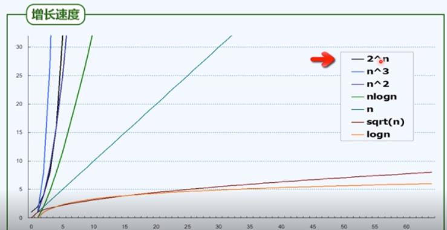

# 算法评估

## 如何评估

如何评估一个算法, 是摆在算法研究首位的问题.

如果我们没有统一的, 可行的标准, 去衡量一个算法, 那么对于算法本身的研究, 是意义不大的.

有这样几个方面可以用来评估一个算法:

1. 正确性

      即能够处理 一般情况/特殊情况的数据, 能够正确处理大规模的数据, 也能够对任意合法输入做出相应的处理.

2. 健壮性

      程序的健壮性, 我们常常会提到, 可以对任意输入, 无论是合法的 或是 非法的做出相应的处理, 不至于退出.

3. 可读性

      包括相关的代码注释, 变量命名, 数据结构设计, 文档, 等等, 毕竟代码, 算法都是给人阅读的.

4. 效率

      效率是我们关注的核心所在, 速度要快, 消耗资源要少.

      算法 + 数据结构, 同时要考虑到效率问题. 这样就是我们理想中的 计算, 程序.

## DSA

在上面已经讲到了, 对于一个算法, 我们最关注的地方在于其有效性 和 高效性.

也即如果一个算法不能够正确的得出结果, 即使效率再高, 也不过是南辕北辙.

极端的例子是: 对于 单位转换, 将 m 和 km之间转换, 自然是  m = 1000 * km, 然而我们有这样的算法, m = 1, 甚至无需计算就有答案, 充分满足高效性.

而高效性, 对于一种案例, 我们在目前所能够达到的 计算资源的 情况下, 需要 2^1024 年才能够计算出来, 这种算法对我们而言, 自然也是不具有意义的.

但需要注意的是, 这种事情并不绝对, 在50年前的计算资源 难以得出结果, 而在当今再来看, 无论是数据储备 还是 机器计算速度, 都能够满足. 算法自然也就可以再被启用. 人工智能就是典型的例子.

而 DSA 即 Data Structure + Algorithm, 数据结构 和 算法. 

### 标尺

在最开始, 就已经提到了 度量本身的重要性, 如果一个算法, 其优劣无法衡量, 那么想要改进一个算法是不可能的, 因为缺少评判标准, 而改进算法, 其目的是使得算法更优.

那怎样才能够被称作 更优呢?

这就是度量本身的重要性, 让我们能够应用统一的标准, 去衡量一个算法的优劣. 或者 在 某种特定规模的数据集的情况下, 哪种算法更优越.

当然, 对于一个算法, 最重要, 最核心的 自然是其正确性. 但是 虽然他很重要, 却往往不是我们关注的地方, 在大多数时候, 无需从数学角度来论证 一个算法是正确的.

而我们的着眼点, 往往就在于:

1. 算法运行的效率, 也即需要多长时间能够计算出来?
2. 算法运行的 空间资源, 也即需要多大的内存, 才能够完成相应的计算? 毕竟数据可以是无限的, 而计算资源是有限的.

而目前, 我们则是将关注点放在 算法运行的效率上, 也即究竟需要多久, 才能够得出结果. 

在这里, 测度一个算法, 其效率我们表示为:

T_A(P): T_A(P), 表示算法A 对于一个给定的问题 P, 比如, 如何使用尺规 将一条直线三等分, 这是一个具体的问题. 而非某一类问题的抽象.

但往往, 我们需要用具体的问题去验证算法的可行性, 效率等等. 然而在探讨问题的时候, 需要将其抽象化, 毕竟算法大都针对的是 某一类问题. 因此 一般用:

T_A 来衡量一个算法的 效率.

而往往, 如何定义一类问题呢? 问题如何被归类呢? 

通过  规模 来进行分类.

当问题的规模比较接近时, 对同一算法 其计算成本也较为接近. 而当规模增大, 其计算成本 也往往会成上升趋势.

因此对于 某一 DSA的度量, 就被转换成了

T(n) 其中n是指问题的规模.

在这里依然需要考虑一个问题, 即使对于同一规模问题, 其结果也可能是完全不同的.
比如对于 n = 9, 也即9个数字从小大排序.

在最好的情况下, 如 1, 2, 3, 4, 5, 6, 7, 8, 9. 无需排序就能够完成.
而在最坏的情况下, 如 9, 8, 7, ..., 2, 1 则需要多次才能够完成排序.

而我们在衡量一个算法的 成本时, 最先考虑的就需要是 最坏的情况, 即在最差的数据输入情况下, 需要多大的成本, 才能够达到算法的目的.  

## 成本

即使有了上面的定义, 简化, 依然存在一个问题, 如何衡量一个算法在最坏情况下的计算成本? 

在上面分析这个问题的时候, 用的是 多久能够计算出来, 关注的是它的效率. 也即时间成本.

那么需要知道的是, 在不同的机器上, 不同的语言, 不同的操作系统, 甚至于 不同人写的同一算法的实现方式, 其执行所需要的时间 都是千差万别的.

但我们的根本目的是为了衡量算法的效率, 难道需要保证上面的种种一致性才能够进行算法的度量吗?

显然不是的.

我们知道, 无论一段程序究竟有多么复杂, 他始终能够被拆解为一个又一个的步骤.

无论是以图灵机模型, 又或是 RAM模型的方式, 去运行这段程序. 最终一定是将步骤分解为 计算机可读的一步又一步的操作. 最小粒度的操作.

我们并不在乎, 这一步在各个系统, 不同性能的计算机上表现究竟有多么不同, 而仅仅关注需要多少步操作.

但又不是狭隘的概念, 比如 对于 1 + 1 = 2, 在一种系统需要三次操作, 另一种系统需要一次, 这不是我们关注的问题.

目前来说, 对于算法成本的衡量, 往往是当n足够大之后, 才在不同的算法之间进行对比, 我们并不关注短期性能. 

当n较小时, 比如100 以内,  DSA  a的性能要优于b, 但随着数据量的上升, a所需要的成本会急剧增加, 而 b维持不变, 那么对我们而言, b 是一个更优秀的算法.

 这样一个概念就渐渐清晰, 相比于规模本身的增长, 内部执行步数的多少 对 算法性能分析 影响不大. 

举例来说, 两种算法之间, A, B. 总计数据规模都是n 的情况下, 算法 A 需要循环 n次, 而算法B 需要循环 n^2 次. 而在每一次循环中, 算法A需要执行70步, 算法B需要执行 5步.

当 n 假设 100w时, A 需要执行的次数是 70 * 100w, 而 B的次数是  100w^2 * 5 .

 

 会发现, 在n越来越大时, 其内循环 的 执行次数可以被忽略, 也即 常量 c 是无关紧要的, 相比于算法的提升, 这些都微不足道.

但同样需要注意的是, 在算法分析层面如此, 那程序设计角度来讲, 真的不重要了吗?

也不是, 当最优算法已经选定, 或者说 算法的 成本本身相差不大时, 内部究竟会执行多少次, 还是很重要的.

很显然, 我们都知道, 执行 70 * 1w 次 与 5 * 1w次 还是有相当大的差距的.

 

## 大O记号

当n足够大的情况下, 用大O记号来对算法成本 进行表示.

也就是说, 我们并不关注这样几点

1. 一时的变化趋势, 我们关注长远的, 随着n逐渐增大的 其整体趋势如何
2. 对存储单元的占用情况.
3. 基本操作的执行次数, 也即上面提到过的 步数.

对上面提到过的 T(n) 做这样一个转换

      T(n) = O(f(n)) 

要求 当 c > 0时, 且 当 n足够大之后, 存在 T(n) < c * f(n), c是一个常量.

举例, 有如下转换: 

5n * [3n * (n + 2) + 4] + 6  < 5n * [6n^2 + 4]  + 6< 35n^3 = O(n^3)

这样我们就将 一个 复杂的 T(n) = 5n * [3n * (n + 2) + 4] + 6

转换成了 O(n^3) 这样的表现形式, 简单易懂.

在转换的核心中, 我们做了以下近似处理.

1. 忽略常数项
2. 忽略低次项

因此最终得以表示为 O(n^3)

### O(1)

O(1), 常数复杂度.

也即能够在常数操作内得到结果的算法.

其操作次数如:

2, 2020, 2020 * 2020, 2020^2020 都可以被视作 O(1), 尽管 2020^2020 是相当大的一个数字, 但对算法的性能分析而言, 依然可以被视作 O(1), 常数解.

O(1) 也是效率最高的 一种算法

什么样的代码对应于 O1的复杂度?

如果一段代码, 不包含 显示 或 隐式的循环,  (循环, 调用, 递归 等等), 也即代码只要顺序执行 就能够得到结果的, 那么必然是 O1的复杂度.

那么反过来看, 一段代码有 循环, 转向, 递归 就意味着一定不是 O(1) 复杂度的吗?

并不是, 需要根据具体的代码来做判定, 可能也许根本就不会触发转向, 递归, 又或者 循环中 做了某些特殊的处理.

### O(log n)

对数多项式复杂度.

对于log n 我们并不在乎其底数究竟是多少.  也不在乎是否有常数幂次.

同样不在乎是否有多项式.

如图所示.

对数多项式复杂度, 其效率也是接近于常数的.

对于任意 常数 C > 0, 使得  log n < O(n^c).

因此 对数多项式复杂度, 其复杂度都是要低于 多项式复杂度的.

### O(n^c)

多项式复杂度.

在刚刚提到过, 我们忽略了常数项, 低次项, 因此对于 多项式复杂度而言, 最终都可以简明的 归结为 最高次项的 复杂度.

也即 O(n^c)

对于这一类的算法, 往往已经是觉得令人满意了.

我们在编程中遇到的绝大多数算法, 都是在 O(n) ~ O(n^2) 之间的复杂度.

多项式复杂度, 至少是 可解的问题.

### O(2^n)

指数复杂度

往往这类算法, 随着n的上涨, 其成本会急速上升, 这种被认为 是 不可解的算法.

## 总结

算法的评估, 我们可以通过 大O记号, 来进行表示.

评估算法的成本, 也即在评估一个算法执行所需要的 基本操作的次数.

我们在评估分析的时候, 忽略了常数项, 低次项. 最终对于一个算法, 从优到劣则是.

O(1) 常数复杂度

O(log n) 多项式复杂度. 也是很接近于常数复杂度的一种算法.

O(n^c) 多项式复杂度, 是我们最常见到的复杂度.

O(2^n) 指数复杂度, 往往都是不可解的.

如图.

我们不能只关注, 一个算法在数据量较小的时候所表现出来的差异. 更需要注重, 算法在n相当大的时候, 算法复杂度的变化趋势.

个人见解:

虽然在算法分析的时候, 我们忽略了常数项, 低次项. 但不难想象, 当两个算法同属于 O(n^c) 时, n^2 与 n ^ 2015 之间所表现出来的巨大差异还是要被关注的.

